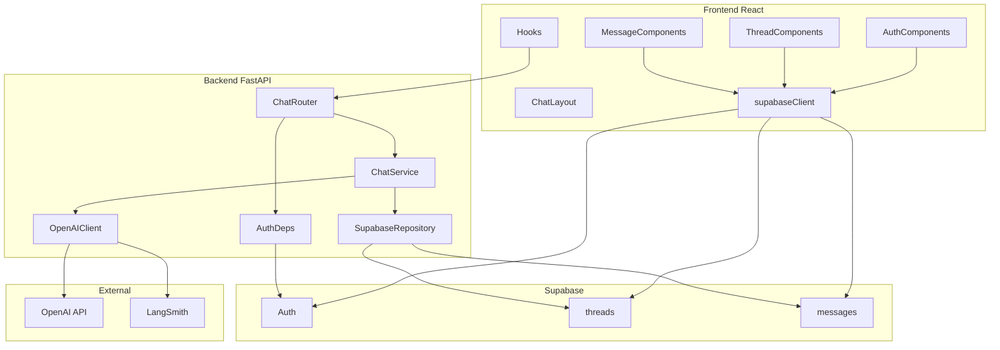

# Module 1: App Shell + Observability

**Complexity:** ⚠️ Medium — likely 2–3 build/validate cycles; executable as one plan if tasks are done in order.

**Choices:** OpenAI direct (`gpt-4o-mini` recommended for dev cost), Supabase **email + password** auth.

**Build via:** [.cursor/commands/build.md](../../.cursor/commands/build.md)

---

## Architecture (component-based)

Components and boundaries—not a step-by-step process flow. Chat memory lives in Supabase; OpenAI is stateless.



### Frontend components

| Component | Path | Responsibility |
| --------- | ---- | ---------------- |
| `supabaseClient` | `lib/supabase.ts` | Shared Supabase client |
| `AuthProvider` | `components/auth/AuthProvider.tsx` | Session state, auth context |
| `ProtectedRoute` | `components/auth/ProtectedRoute.tsx` | Redirect unauthenticated users |
| `LoginForm` | `components/auth/LoginForm.tsx` | Email/password sign-in |
| `SignupForm` | `components/auth/SignupForm.tsx` | Email/password sign-up |
| `ChatLayout` | `components/chat/ChatLayout.tsx` | Shell: sidebar + main pane |
| `ThreadList` | `components/chat/ThreadList.tsx` | List/create threads (Supabase RLS) |
| `ThreadItem` | `components/chat/ThreadItem.tsx` | Single thread row |
| `MessageList` | `components/chat/MessageList.tsx` | Render messages for active thread |
| `MessageBubble` | `components/chat/MessageBubble.tsx` | User vs assistant styling |
| `ChatInput` | `components/chat/ChatInput.tsx` | Send message, trigger stream |
| `useAuth` | `hooks/useAuth.ts` | Read session from `AuthProvider` |
| `useThreads` | `hooks/useThreads.ts` | CRUD threads via Supabase |
| `useMessages` | `hooks/useMessages.ts` | Load messages for thread |
| `useChatStream` | `hooks/useChatStream.ts` | SSE consumer for `/api/chat/stream` |

**Pages** compose components only: `LoginPage`, `SignupPage`, `ChatPage`.

### Backend components

| Component | Path | Responsibility |
| --------- | ---- | ---------------- |
| `main` | `app/main.py` | App factory, CORS, router mount |
| `config` | `app/config.py` | Env settings (Pydantic) |
| `AuthDeps` | `app/deps.py` | Validate Supabase JWT → `user_id` |
| `ChatRouter` | `app/routes/chat.py` | `POST /api/chat/stream` (SSE) |
| `ChatService` | `app/services/chat.py` | Orchestrate history, stream, persist |
| `SupabaseRepository` | `app/services/supabase_client.py` | DB access for threads/messages |
| `OpenAIClient` | `app/services/openai_client.py` | Chat Completions + LangSmith wrap |

### Data components (Supabase)

| Component | Responsibility |
| --------- | ---------------- |
| **Auth** | Email/password; issues JWT for `AuthDeps` |
| **`threads`** | Conversation metadata; `user_id` + RLS |
| **`messages`** | Turn storage; FK to `threads` + RLS |

### External components

| Component | Responsibility |
| --------- | ---------------- |
| **OpenAI** | Stateless Chat Completions (no memory) |
| **LangSmith** | Optional traces on `OpenAIClient` |

**Out of scope:** ingestion UI, pgvector, embeddings, `file_search`, Responses API.

---

## Repo layout (component folders)

```
agentic-rag-sub-agents/
├── backend/
│   ├── app/
│   │   ├── main.py
│   │   ├── config.py
│   │   ├── deps.py                 # AuthDeps
│   │   ├── routes/
│   │   │   └── chat.py             # ChatRouter
│   │   └── services/
│   │       ├── chat.py             # ChatService
│   │       ├── openai_client.py    # OpenAIClient
│   │       └── supabase_client.py  # SupabaseRepository
│   ├── requirements.txt
│   └── README.md
├── frontend/
│   ├── src/
│   │   ├── lib/
│   │   │   └── supabase.ts
│   │   ├── components/
│   │   │   ├── auth/               # AuthProvider, ProtectedRoute, forms
│   │   │   └── chat/               # ChatLayout, ThreadList, MessageList, ChatInput
│   │   ├── hooks/                  # useAuth, useThreads, useMessages, useChatStream
│   │   └── pages/                  # LoginPage, SignupPage, ChatPage
│   ├── package.json
│   └── vite.config.ts
├── supabase/migrations/
│   └── 001_threads_messages.sql
└── .env.example
```

---

## Phase 0: Prerequisites (you, before build)

1. Create a [Supabase](https://supabase.com) project.
2. Enable **Email** provider; confirm email if you want production-like flow (can disable confirm for local dev in Supabase Auth settings).
3. OpenAI API key with billing enabled.
4. [LangSmith](https://smith.langchain.com) account + API key + project name.

No code in this phase—only keys in local `.env` (never committed).

---

## Phase 1: Supabase schema + RLS

**Migration** `supabase/migrations/001_threads_messages.sql`:

- **`threads`**: `id` (uuid PK), `user_id` (uuid → `auth.users`), `title` (text, default `'New chat'`), `created_at`, `updated_at`
- **`messages`**: `id`, `thread_id` (FK → threads ON DELETE CASCADE), `role` (`user` | `assistant` | `system`), `content` (text), `created_at`
- Index: `messages(thread_id, created_at)`
- **RLS enabled** on both tables
- Policies: `user_id = auth.uid()` on threads; messages allowed only if `thread_id` belongs to current user (subquery or join policy)
- Optional: trigger to bump `threads.updated_at` on new message

**Validation:**

- Run migration in Supabase SQL editor or CLI.
- In Supabase Table Editor, confirm RLS shows policies; test insert as authenticated user in SQL with `auth.uid()` set (or via app in Phase 4).

---

## Phase 2: Backend (component scaffold)

**Stack:** Python 3.11+, `venv`, `fastapi`, `uvicorn`, `openai`, `supabase` (py), `pydantic-settings`, Supabase JWT verify, `langsmith` (wrap `OpenAIClient` only—no LangChain).

Implement [Backend components](#backend-components) in order: `config` → `AuthDeps` → `SupabaseRepository` → `OpenAIClient` → `ChatService` → `ChatRouter` → `main`.

**Config** (`config` component) from env:

| Variable | Purpose |
| -------- | ------- |
| `SUPABASE_URL` | Project URL |
| `SUPABASE_ANON_KEY` | Verify user JWTs |
| `OPENAI_API_KEY` | Chat Completions |
| `OPENAI_MODEL` | Default `gpt-4o-mini` |
| `LANGSMITH_API_KEY` | Tracing |
| `LANGSMITH_PROJECT` | Project name |
| `LANGSMITH_TRACING` | `true` / `false` |
| `CORS_ORIGINS` | `http://localhost:5173` |

**`ChatRouter` contract:** `POST /api/chat/stream`

- Headers: `Authorization: Bearer <supabase_access_token>`
- Body: `{ "thread_id": "uuid", "content": "string" }`
- Delegates to `ChatService.stream_reply(user_id, thread_id, content)` → SSE (`token`, `done`)
- `ChatService` owns persistence + OpenAI call; `ChatRouter` only HTTP/SSE
- Errors: 401 (`AuthDeps`), 403 (thread ownership), 502 (`OpenAIClient`)

**Validation:**

- `curl` or HTTPie with a real JWT: stream returns chunks and assistant row appears in Supabase.
- LangSmith UI shows a trace for the request when `LANGSMITH_TRACING=true`.

---

## Phase 3: Frontend (component scaffold)

**Scaffold:** `npm create vite@latest frontend -- --template react-ts`; Tailwind + shadcn/ui.

Build components from the [Frontend components](#frontend-components) table—in dependency order:

1. `lib/supabase.ts` + `AuthProvider` + `ProtectedRoute`
2. `LoginForm` / `SignupForm` → `LoginPage` / `SignupPage`
3. `useThreads`, `useMessages` → `ThreadList`, `MessageList`, `MessageBubble`
4. `ChatInput` + `useChatStream` → `ChatLayout` → `ChatPage` (`/`)

**Component contracts:**

- **Auth:** `AuthProvider` exposes session; forms call Supabase Auth only
- **Threads:** `ThreadList` + `useThreads` own Supabase reads/writes (RLS)
- **Messages:** `MessageList` + `useMessages` load history for `threadId`
- **Stream:** `ChatInput` delegates send to `useChatStream` → `POST /api/chat/stream` (JWT); no OpenAI key in frontend

**Dev proxy:** Vite `/api` → `http://localhost:8000`.

**Validation:**

- Sign up → sign in → create thread → send message → see streamed reply → reload page → history persists.
- Second user cannot read first user's threads (RLS smoke test).

---

## Phase 4: Wiring, docs, progress

- `.env.example` — all keys documented, no secrets
- Root `README.md` — how to run backend + frontend + apply migration
- Update `PROGRESS.md` checkboxes as tasks complete
- Backend `README`: `python -m venv venv`, `pip install -r requirements.txt`, `uvicorn app.main:app --reload`

---

## Task checklist (for build agent)

| # | Task | Validation |
| - | ---- | ---------- |
| 1 | Monorepo folders + `.env.example` | Files exist; README lists env vars |
| 2 | Supabase migration + RLS | Policies visible; manual RLS test |
| 3 | FastAPI skeleton + config + CORS | `GET /health` 200 |
| 4 | JWT dependency + Supabase DB client | Invalid JWT → 401 |
| 5 | `POST /chat/stream` + OpenAI stream | curl SSE works; messages in DB |
| 6 | LangSmith wrap on OpenAI client | Trace visible in LangSmith |
| 7 | Vite + Tailwind + shadcn scaffold | `npm run dev` loads |
| 8 | Auth pages | Sign up / login / logout works |
| 9 | Chat UI + SSE hook | End-to-end chat in browser |
| 10 | PROGRESS.md + README runbook | Checkboxes accurate |

---

## Risks and mitigations

| Risk | Mitigation |
| ---- | ---------- |
| Token overflow on long threads | Load last N messages; document limit in system prompt |
| SSE buffering (proxy) | `X-Accel-Buffering: no`; use `text/event-stream` |
| Email confirm blocks dev | Disable confirm in Supabase Auth for local dev |
| OpenAI cost | Use `gpt-4o-mini`; set OpenAI usage limits |

---

## After Module 1

Module 2 adds ingestion + pgvector + retrieval tool **without** changing the auth/history pattern—only extends the chat service to inject retrieved chunks before the Completions call.
