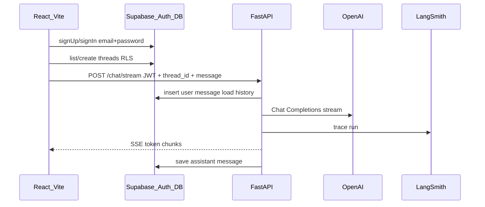

# Module 1: App Shell + Observability

**Complexity:** ⚠️ Medium — likely 2–3 build/validate cycles; executable as one plan if tasks are done in order.

**Choices:** OpenAI direct (`gpt-4o-mini` recommended for dev cost), Supabase **email + password** auth.

**Build via:** [.cursor/commands/build.md](../../.cursor/commands/build.md)

---

## Architecture



| Layer | Responsibility |
| ----- | -------------- |
| **React** | Auth screens, thread sidebar, chat view, SSE consumer |
| **Supabase** | Auth, `threads` / `messages` storage, RLS |
| **FastAPI** | JWT validation, chat stream, OpenAI call, persist assistant reply |
| **OpenAI** | Stateless completion only (no thread memory) |
| **LangSmith** | Trace chat requests (env-toggle) |

**Out of scope:** ingestion UI, pgvector, embeddings, `file_search`, Responses API.

---

## Repo layout (new)

```
agentic-rag-sub-agents/
├── backend/
│   ├── app/
│   │   ├── main.py           # FastAPI app, CORS
│   │   ├── config.py         # pydantic-settings from env
│   │   ├── deps.py           # JWT → Supabase user client
│   │   ├── routes/chat.py    # POST /chat/stream (SSE)
│   │   └── services/
│   │       ├── openai_client.py
│   │       ├── chat.py       # load history, stream, save
│   │       └── supabase_client.py
│   ├── requirements.txt
│   └── README.md             # venv + run instructions
├── frontend/
│   ├── src/
│   │   ├── lib/supabase.ts
│   │   ├── pages/ Login, Signup, Chat
│   │   ├── components/ ThreadList, MessageList, ChatInput
│   │   └── hooks/useChatStream.ts
│   ├── package.json
│   └── vite.config.ts        # proxy /api → backend in dev
├── supabase/migrations/
│   └── 001_threads_messages.sql
├── .env.example
└── docker-compose.yml        # optional; not required for M1
```

---

## Phase 0: Prerequisites (you, before build)

1. Create a [Supabase](https://supabase.com) project.
2. Enable **Email** provider; confirm email if you want production-like flow (can disable confirm for local dev in Supabase Auth settings).
3. OpenAI API key with billing enabled.
4. [LangSmith](https://smith.langchain.com) account + API key + project name.

No code in this phase—only keys in local `.env` (never committed).

---

## Phase 1: Supabase schema + RLS

**Migration** `supabase/migrations/001_threads_messages.sql`:

- **`threads`**: `id` (uuid PK), `user_id` (uuid → `auth.users`), `title` (text, default `'New chat'`), `created_at`, `updated_at`
- **`messages`**: `id`, `thread_id` (FK → threads ON DELETE CASCADE), `role` (`user` | `assistant` | `system`), `content` (text), `created_at`
- Index: `messages(thread_id, created_at)`
- **RLS enabled** on both tables
- Policies: `user_id = auth.uid()` on threads; messages allowed only if `thread_id` belongs to current user (subquery or join policy)
- Optional: trigger to bump `threads.updated_at` on new message

**Validation:**

- Run migration in Supabase SQL editor or CLI.
- In Supabase Table Editor, confirm RLS shows policies; test insert as authenticated user in SQL with `auth.uid()` set (or via app in Phase 4).

---

## Phase 2: Backend (FastAPI + OpenAI + LangSmith)

**Stack:** Python 3.11+, `venv`, `fastapi`, `uvicorn`, `openai`, `supabase` (py), `pydantic-settings`, Supabase JWT verify, `langsmith` (`wrap_openai` or `@traceable` on chat service—no LangChain).

**Config** `backend/app/config.py` from env:

| Variable | Purpose |
| -------- | ------- |
| `SUPABASE_URL` | Project URL |
| `SUPABASE_ANON_KEY` | Verify user JWTs |
| `OPENAI_API_KEY` | Chat Completions |
| `OPENAI_MODEL` | Default `gpt-4o-mini` |
| `LANGSMITH_API_KEY` | Tracing |
| `LANGSMITH_PROJECT` | Project name |
| `LANGSMITH_TRACING` | `true` / `false` |
| `CORS_ORIGINS` | `http://localhost:5173` |

**Endpoint:** `POST /api/chat/stream`

- Headers: `Authorization: Bearer <supabase_access_token>`
- Body: `{ "thread_id": "uuid", "content": "string" }`
- Steps:
  1. Validate JWT → `user_id`
  2. Verify thread belongs to user
  3. Insert **user** message into `messages`
  4. Load ordered messages for thread (cap e.g. last 50 turns for token safety)
  5. Build `messages[]` with fixed **system** prompt (short assistant persona)
  6. Call `openai.chat.completions.create(..., stream=True)`
  7. Return **SSE**: events `token`, then `done` with `message_id`; on stream end insert **assistant** message
- Errors: 401 unauthenticated, 403 wrong thread, 502 upstream OpenAI

**Validation:**

- `curl` or HTTPie with a real JWT: stream returns chunks and assistant row appears in Supabase.
- LangSmith UI shows a trace for the request when `LANGSMITH_TRACING=true`.

---

## Phase 3: Frontend (React + Vite + Tailwind + shadcn)

**Scaffold:** `npm create vite@latest frontend -- --template react-ts`; add Tailwind + shadcn/ui (Button, Input, Card, ScrollArea).

**Supabase client** `frontend/src/lib/supabase.ts`: `VITE_SUPABASE_URL`, `VITE_SUPABASE_ANON_KEY`.

**Pages:**

- `/login`, `/signup` — `supabase.auth.signInWithPassword` / `signUp`
- `/` (protected) — chat layout: thread list + active thread

**Thread UX:**

- Create thread: insert into `threads` (RLS) → navigate to thread
- List threads: `select * from threads order by updated_at desc`
- Load messages: `select * from messages where thread_id = ? order by created_at`

**Send message:**

- Optimistic UI optional; call `POST /api/chat/stream` with session `access_token`
- `useChatStream`: parse SSE, append assistant content live
- On `done`, refresh messages or merge saved ids

**Dev proxy:** Vite proxies `/api` → `http://localhost:8000`.

**Validation:**

- Sign up → sign in → create thread → send message → see streamed reply → reload page → history persists.
- Second user cannot read first user's threads (RLS smoke test).

---

## Phase 4: Wiring, docs, progress

- `.env.example` — all keys documented, no secrets
- Root `README.md` — how to run backend + frontend + apply migration
- Update `PROGRESS.md` checkboxes as tasks complete
- Backend `README`: `python -m venv venv`, `pip install -r requirements.txt`, `uvicorn app.main:app --reload`

---

## Task checklist (for build agent)

| # | Task | Validation |
| - | ---- | ---------- |
| 1 | Monorepo folders + `.env.example` | Files exist; README lists env vars |
| 2 | Supabase migration + RLS | Policies visible; manual RLS test |
| 3 | FastAPI skeleton + config + CORS | `GET /health` 200 |
| 4 | JWT dependency + Supabase DB client | Invalid JWT → 401 |
| 5 | `POST /chat/stream` + OpenAI stream | curl SSE works; messages in DB |
| 6 | LangSmith wrap on OpenAI client | Trace visible in LangSmith |
| 7 | Vite + Tailwind + shadcn scaffold | `npm run dev` loads |
| 8 | Auth pages | Sign up / login / logout works |
| 9 | Chat UI + SSE hook | End-to-end chat in browser |
| 10 | PROGRESS.md + README runbook | Checkboxes accurate |

---

## Risks and mitigations

| Risk | Mitigation |
| ---- | ---------- |
| Token overflow on long threads | Load last N messages; document limit in system prompt |
| SSE buffering (proxy) | `X-Accel-Buffering: no`; use `text/event-stream` |
| Email confirm blocks dev | Disable confirm in Supabase Auth for local dev |
| OpenAI cost | Use `gpt-4o-mini`; set OpenAI usage limits |

---

## After Module 1

Module 2 adds ingestion + pgvector + retrieval tool **without** changing the auth/history pattern—only extends the chat service to inject retrieved chunks before the Completions call.
