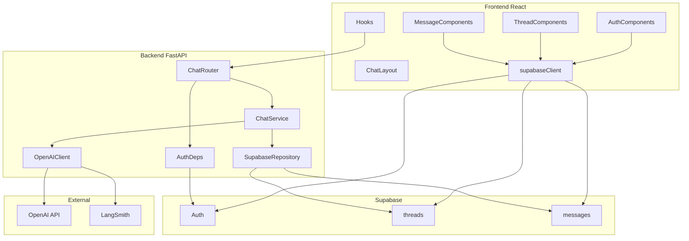

# Module 1: App Shell + Observability

**Complexity:** ⚠️ Medium — likely 2–3 build/validate cycles; executable as one plan if tasks are done in order.

**Choices:** OpenAI direct (`gpt-4o-mini` recommended for dev cost), Supabase **email + password** auth.

**Build via:** [.cursor/commands/build.md](../../.cursor/commands/build.md)

---

## Architecture (component-based)

Components and boundaries—not a step-by-step process flow. Chat memory lives in Supabase; OpenAI is stateless.



### Frontend components

| Component | Path | Responsibility |
| --------- | ---- | ---------------- |
| `supabaseClient` | `lib/supabase.ts` | Shared Supabase client |
| `AuthProvider` | `components/auth/AuthProvider.tsx` | Session state, auth context |
| `ProtectedRoute` | `components/auth/ProtectedRoute.tsx` | Redirect unauthenticated users |
| `LoginForm` | `components/auth/LoginForm.tsx` | Email/password sign-in |
| `SignupForm` | `components/auth/SignupForm.tsx` | Email/password sign-up |
| `ChatLayout` | `components/chat/ChatLayout.tsx` | Shell: sidebar + main pane |
| `ThreadList` | `components/chat/ThreadList.tsx` | List/create threads (Supabase RLS) |
| `ThreadItem` | `components/chat/ThreadItem.tsx` | Single thread row |
| `MessageList` | `components/chat/MessageList.tsx` | Render messages for active thread |
| `MessageBubble` | `components/chat/MessageBubble.tsx` | User vs assistant styling |
| `ChatInput` | `components/chat/ChatInput.tsx` | Send message, trigger stream |
| `useAuth` | `hooks/useAuth.ts` | Read session from `AuthProvider` |
| `useThreads` | `hooks/useThreads.ts` | CRUD threads via Supabase |
| `useMessages` | `hooks/useMessages.ts` | Load messages for thread |
| `useChatStream` | `hooks/useChatStream.ts` | SSE consumer for `/api/chat/stream` |

**Pages** compose components only: `LoginPage`, `SignupPage`, `ChatPage`.

### Backend components

| Component | Path | Responsibility |
| --------- | ---- | ---------------- |
| `main` | `app/main.py` | App factory, CORS, router mount |
| `config` | `app/config.py` | Env settings (Pydantic) |
| `AuthDeps` | `app/deps.py` | Validate Supabase JWT → `user_id` |
| `ChatRouter` | `app/routes/chat.py` | `POST /api/chat/stream` (SSE) |
| `ChatService` | `app/services/chat.py` | Orchestrate history, stream, persist |
| `SupabaseRepository` | `app/services/supabase_client.py` | DB access for threads/messages |
| `OpenAIClient` | `app/services/openai_client.py` | Chat Completions + LangSmith wrap |

### Data components (Supabase)

| Component | Responsibility |
| --------- | ---------------- |
| **Auth** | Email/password; issues JWT for `AuthDeps` |
| **`threads`** | Conversation metadata; `user_id` + RLS |
| **`messages`** | Turn storage; FK to `threads` + RLS |

### External components

| Component | Responsibility |
| --------- | ---------------- |
| **OpenAI** | Stateless Chat Completions (no memory) |
| **LangSmith** | Optional traces on `OpenAIClient` |

**Out of scope:** ingestion UI, pgvector, embeddings, `file_search`, Responses API.

---

## Repo layout (component folders)

```
agentic-rag-sub-agents/
├── backend/
│   ├── app/
│   │   ├── main.py
│   │   ├── config.py
│   │   ├── deps.py                 # AuthDeps
│   │   ├── routes/
│   │   │   └── chat.py             # ChatRouter
│   │   └── services/
│   │       ├── chat.py             # ChatService
│   │       ├── openai_client.py    # OpenAIClient
│   │       └── supabase_client.py  # SupabaseRepository
│   ├── requirements.txt
│   └── README.md
├── frontend/
│   ├── src/
│   │   ├── lib/
│   │   │   └── supabase.ts
│   │   ├── components/
│   │   │   ├── auth/               # AuthProvider, ProtectedRoute, forms
│   │   │   └── chat/               # ChatLayout, ThreadList, MessageList, ChatInput
│   │   ├── hooks/                  # useAuth, useThreads, useMessages, useChatStream
│   │   └── pages/                  # LoginPage, SignupPage, ChatPage
│   ├── package.json
│   └── vite.config.ts
├── supabase/migrations/
│   └── 001_threads_messages.sql
└── .env.example
```

---

## How to use task cards

- Work **in order** within each phase unless **Depends on** says otherwise.
- Mark cards done in this file or mirror in `PROGRESS.md`.
- Do not skip **Validate** on any card.

**Card ID format:** `P{phase}-T{number}` (e.g. `P2-T4`)

---

## Phase 0: Prerequisites

> No code — accounts, keys, local env. Owner: **you**.

#### Card P0-T1: Create Supabase project

| | |
| --- | --- |
| **Depends on** | — |
| **Steps** | 1. Sign up at [supabase.com](https://supabase.com) <br> 2. Create a new project <br> 3. Copy **Project URL** and **anon public** key |
| **Validate** | Dashboard loads; URL + anon key saved locally (not committed) |

#### Card P0-T2: Configure email auth

| | |
| --- | --- |
| **Depends on** | P0-T1 |
| **Steps** | 1. Authentication → Providers → enable **Email** <br> 2. For local dev: optionally disable **Confirm email** |
| **Validate** | Email provider shows enabled in Supabase Auth settings |

#### Card P0-T3: OpenAI API key

| | |
| --- | --- |
| **Depends on** | — |
| **Steps** | 1. Create key at [platform.openai.com](https://platform.openai.com) <br> 2. Set usage limits / budget alert <br> 3. Plan to use model `gpt-4o-mini` |
| **Validate** | Key created; billing active |

#### Card P0-T4: LangSmith project

| | |
| --- | --- |
| **Depends on** | — |
| **Steps** | 1. Sign up at [smith.langchain.com](https://smith.langchain.com) <br> 2. Create a project <br> 3. Copy API key |
| **Validate** | Project visible in LangSmith UI |

#### Card P0-T5: Local environment files

| | |
| --- | --- |
| **Depends on** | P0-T1, P0-T3, P0-T4, P4-T1 |
| **Steps** | 1. Copy `.env.example` → `backend/.env` and `frontend/.env` <br> 2. Fill all keys |
| **Validate** | Both `.env` files exist; `git status` does not stage `.env` |

---

## Phase 1: Supabase schema + RLS

> Data components: `threads`, `messages`, RLS.

#### Card P1-T1: Migration file scaffold

| | |
| --- | --- |
| **Component** | `supabase/migrations/001_threads_messages.sql` |
| **Depends on** | P0-T1 |
| **Steps** | 1. Create `supabase/migrations/` <br> 2. Add migration file with header comment |
| **Validate** | File exists in repo |

#### Card P1-T2: `threads` table

| | |
| --- | --- |
| **Component** | `threads` |
| **Depends on** | P1-T1 |
| **Steps** | 1. `id` uuid PK default `gen_random_uuid()` <br> 2. `user_id` uuid NOT NULL → `auth.users(id)` on delete cascade <br> 3. `title` text default `'New chat'` <br> 4. `created_at`, `updated_at` timestamptz default `now()` |
| **Validate** | SQL runs in Supabase SQL editor |

#### Card P1-T3: `messages` table

| | |
| --- | --- |
| **Component** | `messages` |
| **Depends on** | P1-T2 |
| **Steps** | 1. `id`, `thread_id` FK → `threads` on delete cascade <br> 2. `role` check (`user`,`assistant`,`system`) <br> 3. `content` text not null, `created_at` <br> 4. Index `(thread_id, created_at)` |
| **Validate** | FK visible in Table Editor |

#### Card P1-T4: RLS policies

| | |
| --- | --- |
| **Component** | RLS |
| **Depends on** | P1-T3 |
| **Steps** | 1. Enable RLS on both tables <br> 2. **threads:** CRUD where `user_id = auth.uid()` <br> 3. **messages:** CRUD where `thread_id` in (select `id` from threads where `user_id = auth.uid()`) |
| **Validate** | Policies visible under Authentication → Policies |

#### Card P1-T5: `updated_at` trigger (optional)

| | |
| --- | --- |
| **Depends on** | P1-T3 |
| **Steps** | 1. Function updates `threads.updated_at` on message insert <br> 2. Attach trigger to `messages` |
| **Validate** | New message bumps parent `threads.updated_at` |

#### Card P1-T6: Apply migration

| | |
| --- | --- |
| **Depends on** | P1-T4 |
| **Steps** | 1. Run full SQL in Supabase SQL editor <br> 2. Confirm tables in Table Editor |
| **Validate** | `threads` + `messages` exist; RLS shield enabled |

---

## Phase 2: Backend

> Python 3.11+, `venv`, FastAPI, raw OpenAI SDK, `langsmith` on `OpenAIClient` only.

**Env vars (`config` component):** `SUPABASE_URL`, `SUPABASE_ANON_KEY`, `OPENAI_API_KEY`, `OPENAI_MODEL` (`gpt-4o-mini`), `LANGSMITH_API_KEY`, `LANGSMITH_PROJECT`, `LANGSMITH_TRACING`, `CORS_ORIGINS`

#### Card P2-T1: Backend folder + dependencies

| | |
| --- | --- |
| **Depends on** | P1-T6 |
| **Steps** | 1. Create `backend/app/` per repo layout <br> 2. `requirements.txt`: fastapi, uvicorn, openai, supabase, pydantic-settings, PyJWT, httpx, langsmith, sse-starlette <br> 3. `python -m venv venv` + pip install |
| **Validate** | venv activates; packages installed |

#### Card P2-T2: `config` component

| | |
| --- | --- |
| **Component** | `app/config.py` |
| **Depends on** | P2-T1 |
| **Steps** | 1. Pydantic Settings for env vars above <br> 2. Export `settings` singleton |
| **Validate** | Import in REPL; missing var raises clear error |

#### Card P2-T3: `main` + health + CORS

| | |
| --- | --- |
| **Component** | `app/main.py` |
| **Depends on** | P2-T2 |
| **Steps** | 1. FastAPI + CORSMiddleware <br> 2. `GET /health` → `{"status":"ok"}` <br> 3. Mount `/api` routers |
| **Validate** | `curl localhost:8000/health` → 200 |

#### Card P2-T4: `AuthDeps` component

| | |
| --- | --- |
| **Component** | `app/deps.py` |
| **Depends on** | P2-T2 |
| **Steps** | 1. Read `Authorization: Bearer` <br> 2. Verify Supabase JWT → `user_id` <br> 3. Else 401 |
| **Validate** | Test route: no token → 401; valid JWT → 200 |

#### Card P2-T5: `SupabaseRepository` component

| | |
| --- | --- |
| **Component** | `app/services/supabase_client.py` |
| **Depends on** | P2-T4 |
| **Steps** | 1. Client uses user JWT (RLS) <br> 2. Methods: verify owner, list messages (cap 50), insert message |
| **Validate** | Manual test: insert + list on owned thread |

#### Card P2-T6: `OpenAIClient` component

| | |
| --- | --- |
| **Component** | `app/services/openai_client.py` |
| **Depends on** | P2-T2 |
| **Steps** | 1. `wrap_openai` when tracing enabled <br> 2. `stream_chat(messages)` → content deltas |
| **Validate** | Script streams tokens for dummy messages |

#### Card P2-T7: `ChatService` component

| | |
| --- | --- |
| **Component** | `app/services/chat.py` |
| **Depends on** | P2-T5, P2-T6 |
| **Steps** | 1. `stream_reply`: verify owner → save user msg → load history → system prompt → stream OpenAI <br> 2. Save assistant msg when done |
| **Validate** | Unit test or integration via P2-T8 |

#### Card P2-T8: `ChatRouter` component

| | |
| --- | --- |
| **Component** | `app/routes/chat.py` |
| **Depends on** | P2-T4, P2-T7 |
| **Steps** | 1. `POST /api/chat/stream` body `{thread_id, content}` <br> 2. SSE events `token`, `done` <br> 3. 403 wrong thread; 502 OpenAI error |
| **Validate** | curl -N with JWT streams tokens |

#### Card P2-T9: DB row + LangSmith trace

| | |
| --- | --- |
| **Depends on** | P2-T8, P0-T4 |
| **Steps** | 1. Confirm assistant row in `messages` <br> 2. Find trace in LangSmith |
| **Validate** | Row exists; trace visible if tracing on |

#### Card P2-T10: Backend README

| | |
| --- | --- |
| **Depends on** | P2-T3 |
| **Steps** | Document venv, install, uvicorn, env vars |
| **Validate** | API starts from README instructions alone |

---

## Phase 3: Frontend

> See [Frontend components](#frontend-components).

#### Card P3-T1: Vite + TypeScript scaffold

| | |
| --- | --- |
| **Depends on** | P2-T3 |
| **Steps** | 1. `npm create vite@latest frontend -- --template react-ts` <br> 2. `npm install` + `npm run dev` |
| **Validate** | Vite page at `:5173` |

#### Card P3-T2: Tailwind + shadcn/ui

| | |
| --- | --- |
| **Depends on** | P3-T1 |
| **Steps** | 1. Install Tailwind <br> 2. Init shadcn; add Button, Input, Card, ScrollArea |
| **Validate** | Styled shadcn button renders |

#### Card P3-T3: `supabaseClient`

| | |
| --- | --- |
| **Component** | `src/lib/supabase.ts` |
| **Depends on** | P3-T1, P0-T5 |
| **Steps** | `createClient(VITE_SUPABASE_URL, VITE_SUPABASE_ANON_KEY)` |
| **Validate** | No runtime error on import |

#### Card P3-T4: `AuthProvider` + `ProtectedRoute`

| | |
| --- | --- |
| **Depends on** | P3-T3 |
| **Steps** | 1. Auth context + `onAuthStateChange` <br> 2. Redirect unauthenticated to `/login` <br> 3. `useAuth` hook |
| **Validate** | `/` redirects when logged out |

#### Card P3-T5: Auth forms + pages

| | |
| --- | --- |
| **Depends on** | P3-T4, P0-T2 |
| **Steps** | 1. Signup + login forms <br> 2. Routes `/login`, `/signup` <br> 3. Logout |
| **Validate** | Sign up → login → `/`; logout works |

#### Card P3-T6: `useThreads` + `ThreadList`

| | |
| --- | --- |
| **Depends on** | P3-T5, P1-T6 |
| **Steps** | 1. List threads by `updated_at` <br> 2. New chat inserts row <br> 3. Select active thread |
| **Validate** | Two threads; switching works |

#### Card P3-T7: `useMessages` + `MessageList`

| | |
| --- | --- |
| **Depends on** | P3-T6 |
| **Steps** | 1. Load messages by `threadId` <br> 2. `MessageBubble` user vs assistant styles |
| **Validate** | History renders after reload |

#### Card P3-T8: `useChatStream` + `ChatInput`

| | |
| --- | --- |
| **Depends on** | P3-T7, P2-T8 |
| **Steps** | 1. POST `/api/chat/stream` + Bearer token <br> 2. Parse SSE; live assistant text <br> 3. Disable input while streaming |
| **Validate** | Streamed reply appears in UI |

#### Card P3-T9: `ChatLayout` + `ChatPage`

| | |
| --- | --- |
| **Depends on** | P3-T6, P3-T7, P3-T8 |
| **Steps** | Sidebar + main pane; `/` protected |
| **Validate** | Full chat UI at `/` |

#### Card P3-T10: Vite API proxy

| | |
| --- | --- |
| **Depends on** | P3-T8 |
| **Steps** | Proxy `/api` → `localhost:8000` in `vite.config.ts` |
| **Validate** | No CORS errors on stream |

#### Card P3-T11: Frontend E2E validation

| | |
| --- | --- |
| **Depends on** | P3-T9, P3-T10, P2-T9 |
| **Steps** | 1. Sign up → chat → stream reply <br> 2. Reload → history persists <br> 3. Optional: second user RLS check |
| **Validate** | All checks pass in browser |

---

## Phase 4: Docs + closeout

#### Card P4-T1: `.env.example`

| | |
| --- | --- |
| **Depends on** | P2-T2, P3-T3 |
| **Steps** | Document all backend + frontend env vars; placeholders only |
| **Validate** | P0-T5 completable from examples |

#### Card P4-T2: Root README runbook

| | |
| --- | --- |
| **Depends on** | P2-T10, P3-T11 |
| **Steps** | Prerequisites, migration, start servers, first chat |
| **Validate** | Clean clone → working chat via README |

#### Card P4-T3: Update `PROGRESS.md`

| | |
| --- | --- |
| **Depends on** | P3-T11 |
| **Steps** | Mark Module 1 items `[x]` |
| **Validate** | PROGRESS matches reality |

#### Card P4-T4: RLS smoke test (document)

| | |
| --- | --- |
| **Depends on** | P3-T11 |
| **Steps** | Two-user test; User B cannot access User A thread |
| **Validate** | Documented in README |

---

## Master progress index

| Card | Title | Phase |
| ---- | ----- | ----- |
| P0-T1 | Create Supabase project | 0 |
| P0-T2 | Configure email auth | 0 |
| P0-T3 | OpenAI API key | 0 |
| P0-T4 | LangSmith project | 0 |
| P0-T5 | Local environment files | 0 |
| P1-T1 | Migration file scaffold | 1 |
| P1-T2 | `threads` table | 1 |
| P1-T3 | `messages` table | 1 |
| P1-T4 | RLS policies | 1 |
| P1-T5 | `updated_at` trigger (optional) | 1 |
| P1-T6 | Apply migration | 1 |
| P2-T1 | Backend folder + dependencies | 2 |
| P2-T2 | `config` component | 2 |
| P2-T3 | `main` + health + CORS | 2 |
| P2-T4 | `AuthDeps` component | 2 |
| P2-T5 | `SupabaseRepository` component | 2 |
| P2-T6 | `OpenAIClient` component | 2 |
| P2-T7 | `ChatService` component | 2 |
| P2-T8 | `ChatRouter` component | 2 |
| P2-T9 | DB row + LangSmith trace | 2 |
| P2-T10 | Backend README | 2 |
| P3-T1 | Vite + TypeScript scaffold | 3 |
| P3-T2 | Tailwind + shadcn/ui | 3 |
| P3-T3 | `supabaseClient` | 3 |
| P3-T4 | `AuthProvider` + `ProtectedRoute` | 3 |
| P3-T5 | Auth forms + pages | 3 |
| P3-T6 | `useThreads` + `ThreadList` | 3 |
| P3-T7 | `useMessages` + `MessageList` | 3 |
| P3-T8 | `useChatStream` + `ChatInput` | 3 |
| P3-T9 | `ChatLayout` + `ChatPage` | 3 |
| P3-T10 | Vite API proxy | 3 |
| P3-T11 | Frontend E2E validation | 3 |
| P4-T1 | `.env.example` | 4 |
| P4-T2 | Root README runbook | 4 |
| P4-T3 | Update `PROGRESS.md` | 4 |
| P4-T4 | RLS smoke test (document) | 4 |

---

## Risks and mitigations

| Risk | Mitigation |
| ---- | ---------- |
| Token overflow on long threads | Load last N messages; document limit in system prompt |
| SSE buffering (proxy) | `X-Accel-Buffering: no`; use `text/event-stream` |
| Email confirm blocks dev | Disable confirm in Supabase Auth for local dev |
| OpenAI cost | Use `gpt-4o-mini`; set OpenAI usage limits |

---

## After Module 1

Module 2 adds ingestion + pgvector + retrieval tool **without** changing the auth/history pattern—only extends the chat service to inject retrieved chunks before the Completions call.
