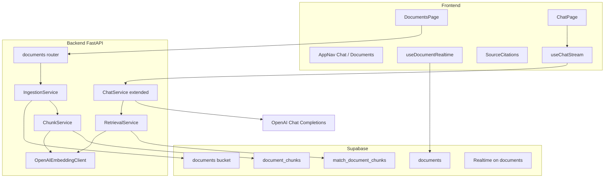

# Module 2: BYO Retrieval + RAG

**Complexity:** ⚠️ Medium–Complex — expect 3–4 build/validate cycles; execute cards in order.

**Choices:** OpenAI `text-embedding-3-small` (1536-dim), file types `.txt` / `.md` / basic PDF (`pypdf`).

**Build via:** [.cursor/commands/build.md](../../.cursor/commands/build.md)

---

## Git commit policy

**One commit per task card** after that card’s **Validate** step passes.

- **Branch:** `module-2-rag` (recommended; merge to `main` when Module 2 is done)
- **Message format:** `feat(m2): P{n}-T{m} <short imperative description>`
- **Examples:**
  - `feat(m2): P1-T1 add pgvector and documents migration`
  - `feat(m2): P4-T3 add upload dropzone and document list UI`
- **Do not** batch multiple cards in one commit
- **Do not** commit `.env` files
- **Pre-flight:** Commit or stash current uncommitted Module 1 UX work (`ThinkingIndicator`, stream tweaks) as `chore: polish chat streaming UX` before starting P0

---

## Architecture



**Chat flow (extends Module 1):**

1. User sends message → save user row (unchanged)
2. Embed query via `text-embedding-3-small`
3. `match_document_chunks` (user-scoped, top-k, similarity threshold)
4. Build system prompt with retrieved chunks + citation metadata
5. Stream assistant reply; persist assistant row with `metadata.sources`
6. SSE emits `sources` event before `token` events so UI can show citations

---

## UI standards (good enough bar)

Match existing slate/white shadcn look in `frontend/src/components/chat/ChatLayout.tsx`.

| Area | UX |
|------|-----|
| **App shell** | Header nav: **Chat** \| **Documents**; active route highlight; keep logout |
| **Documents** | Drag-and-drop zone + “Browse files”; accepted types `.txt,.md,.pdf`; max size shown (e.g. 10 MB) |
| **Document list** | Card/table: filename, size, uploaded time, **status badge** (pending / processing / ready / failed), delete action |
| **Processing** | Spinner on row while `processing`; Realtime updates without refresh |
| **Errors** | Failed rows show red badge + short error message (truncated) |
| **Chat** | Assistant messages show **Sources** chips (filename, optional snippet); empty state when no docs: subtle hint “Upload documents to enable RAG” |
| **Empty docs page** | Illustration-style empty state + CTA to upload |

**New shadcn/ui components:** `Badge`, `Progress` (optional for upload), `Separator` — via existing shadcn init pattern.

**No** heavy new UI libraries; optional `react-markdown` only if time permits in P5-T4 (nice-to-have, not blocking).

---

## Repo additions (target layout)

```
supabase/migrations/002_documents_rag.sql
backend/app/routes/documents.py
backend/app/services/ingestion.py
backend/app/services/chunking.py
backend/app/services/embedding.py
backend/app/services/retrieval.py
frontend/src/pages/DocumentsPage.tsx
frontend/src/components/documents/*
frontend/src/components/layout/AppNav.tsx
frontend/src/hooks/useDocuments.ts
frontend/src/hooks/useDocumentRealtime.ts
```

Extend: `backend/app/config.py`, `backend/app/services/chat.py`, `backend/app/services/openai_client.py`, `frontend/src/App.tsx`, `frontend/src/hooks/useChatStream.ts`, `frontend/src/components/chat/MessageBubble.tsx`.

---

## How to use task cards

- Work **in order** within each phase unless **Depends on** says otherwise.
- Mark cards done in this file or mirror in `PROGRESS.md`.
- Do not skip **Validate** on any card.
- **Commit** after each card’s Validate step (see Git commit policy).

**Card ID format:** `P{phase}-T{number}` (e.g. `P2-T4`)

---

## Phase 0: Prerequisites

> Mostly manual; code commits only where noted.

#### Card P0-T0: Baseline commit (Module 1 WIP)

| | |
| --- | --- |
| **Steps** | Commit/stash current chat UX changes on `main` or `module-2-rag` |
| **Validate** | `git status` clean before Module 2 |
| **Commit** | `chore: polish chat streaming and thinking indicator` |

#### Card P0-T1: Supabase Storage bucket

| | |
| --- | --- |
| **Steps** | Dashboard → Storage → bucket `documents` (private); note bucket name |
| **Validate** | Bucket exists; not public |

#### Card P0-T2: Env vars for embeddings + RAG

| | |
| --- | --- |
| **Steps** | Extend `.env.example`: `OPENAI_EMBEDDING_MODEL=text-embedding-3-small`, `RAG_TOP_K=5`, `RAG_MATCH_THRESHOLD=0.7`, `MAX_UPLOAD_BYTES=10485760`, chunk settings |
| **Validate** | Local `backend/.env` filled; app starts |
| **Commit** | `feat(m2): P0-T2 document embedding and RAG env vars` |

---

## Phase 1: Supabase schema + RLS + RPC

> Single migration file `supabase/migrations/002_documents_rag.sql`, grown card-by-card.

#### Card P1-T1: Enable pgvector

| | |
| --- | --- |
| **Steps** | `create extension if not exists vector;` |
| **Validate** | Extension visible in Supabase Database → Extensions |
| **Commit** | `feat(m2): P1-T1 enable pgvector extension` |

#### Card P1-T2: `documents` table

| | |
| --- | --- |
| **Columns** | `id`, `user_id`, `filename`, `mime_type`, `storage_path`, `status` (`pending`/`processing`/`ready`/`failed`), `error_message`, `byte_size`, timestamps |
| **Validate** | Table in editor; RLS enabled |
| **Commit** | `feat(m2): P1-T2 add documents table with RLS` |

#### Card P1-T3: `document_chunks` table

| | |
| --- | --- |
| **Columns** | `id`, `document_id`, `user_id`, `chunk_index`, `content`, `embedding vector(1536)`, `token_count` optional |
| **Index** | HNSW on `embedding` with `vector_cosine_ops` |
| **Validate** | pgvector column type accepted |
| **Commit** | `feat(m2): P1-T3 add document_chunks with vector index` |

#### Card P1-T4: Storage RLS policies

| | |
| --- | --- |
| **Steps** | Policies: users read/write/delete only under `{user_id}/*` in `documents` bucket |
| **Validate** | Policy list in dashboard |
| **Commit** | `feat(m2): P1-T4 add storage RLS policies` |

#### Card P1-T5: `match_document_chunks` RPC

| | |
| --- | --- |
| **Steps** | SQL function: input `query_embedding`, `match_count`, `match_threshold`; filter `user_id = auth.uid()`; return chunk id, content, document_id, filename, similarity |
| **Validate** | `select` from SQL editor with dummy vector returns empty set (no error) |
| **Commit** | `feat(m2): P1-T5 add vector similarity match RPC` |

#### Card P1-T6: Message metadata for citations

| | |
| --- | --- |
| **Steps** | `alter table messages add column metadata jsonb default '{}';` |
| **Validate** | Column visible; existing rows unaffected |
| **Commit** | `feat(m2): P1-T6 add message metadata for sources` |

#### Card P1-T7: Realtime on `documents`

| | |
| --- | --- |
| **Steps** | Enable Realtime for `documents` table (publication) |
| **Validate** | Realtime inspector shows table |
| **Commit** | `feat(m2): P1-T7 enable realtime on documents` |

#### Card P1-T8: Apply migration

| | |
| --- | --- |
| **Steps** | Run full `002_documents_rag.sql` in SQL Editor |
| **Validate** | Tables + RPC + RLS + extension OK |
| **Commit** | None (manual apply only) |

---

## Phase 2: Backend — ingestion pipeline

#### Card P2-T1: Dependencies

| | |
| --- | --- |
| **Steps** | Add `pypdf` (PDF text), `python-multipart` (upload) to `backend/requirements.txt` |
| **Validate** | `pip install -r requirements.txt` in venv |
| **Commit** | `feat(m2): P2-T1 add ingestion dependencies` |

#### Card P2-T2: Config for RAG + embeddings

| | |
| --- | --- |
| **Steps** | Extend `backend/app/config.py`: `openai_embedding_model`, `rag_top_k`, `rag_match_threshold`, `chunk_size`, `chunk_overlap`, `max_upload_bytes`, RAG system prompt template |
| **Validate** | Import settings; missing vars error clearly |
| **Commit** | `feat(m2): P2-T2 add RAG and embedding settings` |

#### Card P2-T3: `OpenAIEmbeddingClient`

| | |
| --- | --- |
| **Steps** | New `backend/app/services/embedding.py`: `embed_texts(list[str])` → list[vectors] via `embeddings.create` |
| **Validate** | Small script embeds "hello" → 1536-dim vector |
| **Commit** | `feat(m2): P2-T3 add OpenAI embedding client` |

#### Card P2-T4: `ChunkService`

| | |
| --- | --- |
| **Steps** | `backend/app/services/chunking.py`: extract text from txt/md; PDF via pypdf; split with size/overlap |
| **Validate** | Unit-style: sample md → N chunks |
| **Commit** | `feat(m2): P2-T4 add text extraction and chunking` |

#### Card P2-T5: Supabase repo — documents + chunks

| | |
| --- | --- |
| **Steps** | Extend `backend/app/services/supabase_client.py`: CRUD documents, insert chunks, storage upload/download, call `match_document_chunks` RPC |
| **Validate** | Manual insert/list with user JWT |
| **Commit** | `feat(m2): P2-T5 extend supabase repo for documents` |

#### Card P2-T6: `IngestionService`

| | |
| --- | --- |
| **Steps** | `backend/app/services/ingestion.py`: create doc → upload storage → status `processing` → chunk → embed batch → insert chunks → `ready` or `failed` |
| **Validate** | POST upload via curl; rows in `documents` + `document_chunks` |
| **Commit** | `feat(m2): P2-T6 add ingestion service pipeline` |

#### Card P2-T7: `DocumentsRouter`

| | |
| --- | --- |
| **Steps** | `backend/app/routes/documents.py`: `POST /api/documents/upload`, `GET /api/documents`, `DELETE /api/documents/{id}`; mount in `backend/app/main.py` |
| **Validate** | Upload .txt; list returns doc; delete removes storage + rows |
| **Commit** | `feat(m2): P2-T7 add documents API routes` |

---

## Phase 3: Backend — retrieval in chat

#### Card P3-T1: `RetrievalService`

| | |
| --- | --- |
| **Steps** | `backend/app/services/retrieval.py`: embed query → RPC → format context blocks + source DTOs |
| **Validate** | With seeded chunks, query returns relevant hits above threshold |
| **Commit** | `feat(m2): P3-T1 add retrieval service` |

#### Card P3-T2: Extend `ChatService` for RAG

| | |
| --- | --- |
| **Steps** | Before OpenAI: call retrieval; inject context in system message; update system prompt to cite sources; save assistant `metadata.sources` |
| **Validate** | Chat answer references uploaded doc content |
| **Commit** | `feat(m2): P3-T2 wire RAG into chat service` |

#### Card P3-T3: SSE `sources` event

| | |
| --- | --- |
| **Steps** | `backend/app/routes/chat.py`: emit `event: sources` with JSON `[{document_id, filename, snippet, similarity}]` before tokens |
| **Validate** | curl -N shows `sources` then `token` events |
| **Commit** | `feat(m2): P3-T3 stream citation sources over SSE` |

#### Card P3-T4: Backend RAG smoke test

| | |
| --- | --- |
| **Steps** | Upload doc → ask question in same user session |
| **Validate** | Answer grounded; LangSmith trace shows retrieval step (optional span name) |
| **Commit** | `test(m2): P3-T4 document backend RAG smoke steps` (only if adding a small `backend/scripts/rag_smoke.md` or README section — otherwise skip commit, validation only) |

---

## Phase 4: Frontend — Documents UI

#### Card P4-T1: shadcn primitives

| | |
| --- | --- |
| **Steps** | Add Badge, Separator (and Progress if used) |
| **Validate** | Components render in isolation |
| **Commit** | `feat(m2): P4-T1 add shadcn badge and separator` |

#### Card P4-T2: `AppNav` + routes

| | |
| --- | --- |
| **Steps** | `frontend/src/components/layout/AppNav.tsx`; update `ChatLayout` header; `App.tsx` route `/documents` |
| **Validate** | Navigate Chat ↔ Documents; active state correct |
| **Commit** | `feat(m2): P4-T2 add app navigation and documents route` |

#### Card P4-T3: `useDocuments` + API helpers

| | |
| --- | --- |
| **Steps** | `frontend/src/lib/api.ts`: upload (multipart), list, delete with Bearer token |
| **Validate** | Network tab shows successful upload |
| **Commit** | `feat(m2): P4-T3 add documents API client hooks` |

#### Card P4-T4: Upload dropzone + file picker

| | |
| --- | --- |
| **Steps** | `frontend/src/components/documents/UploadDropzone.tsx`: drag/drop, accept filter, disabled while uploading |
| **Validate** | Drop .md file → upload starts |
| **Commit** | `feat(m2): P4-T4 add document upload dropzone` |

#### Card P4-T5: Document list + status badges

| | |
| --- | --- |
| **Steps** | `DocumentList.tsx`, `StatusBadge.tsx`, `DocumentsPage.tsx` |
| **Validate** | List shows files; status updates visually |
| **Commit** | `feat(m2): P4-T5 add document list with status badges` |

#### Card P4-T6: Realtime status updates

| | |
| --- | --- |
| **Steps** | `frontend/src/hooks/useDocumentRealtime.ts`: subscribe to `documents` changes for current user |
| **Validate** | Upload → processing → ready without page reload |
| **Commit** | `feat(m2): P4-T6 subscribe to document realtime updates` |

#### Card P4-T7: Delete document

| | |
| --- | --- |
| **Steps** | Delete button + confirm; call DELETE API; optimistic UI |
| **Validate** | Row removed; chunks gone in DB |
| **Commit** | `feat(m2): P4-T7 add document delete action` |

#### Card P4-T8: Documents empty state

| | |
| --- | --- |
| **Steps** | Polished empty state on Documents page |
| **Validate** | New user sees CTA, not blank page |
| **Commit** | `feat(m2): P4-T8 add documents empty state` |

---

## Phase 5: Frontend — Chat RAG UX

#### Card P5-T1: Parse SSE `sources` in `useChatStream`

| | |
| --- | --- |
| **Steps** | Extend `frontend/src/hooks/useChatStream.ts` to capture sources before tokens |
| **Validate** | Console/state shows sources array on chat |
| **Commit** | `feat(m2): P5-T1 handle sources SSE event in chat stream` |

#### Card P5-T2: `SourceCitations` component

| | |
| --- | --- |
| **Steps** | `frontend/src/components/chat/SourceCitations.tsx`: chips with filename + hover/title snippet |
| **Validate** | Renders below assistant bubble during/after stream |
| **Commit** | `feat(m2): P5-T2 add source citations UI` |

#### Card P5-T3: Persisted citations from `metadata`

| | |
| --- | --- |
| **Steps** | `useMessages.ts` + `MessageBubble.tsx`: load `metadata.sources` on reload |
| **Validate** | Refresh page → citations still visible on old answers |
| **Commit** | `feat(m2): P5-T3 show persisted citations from message metadata` |

#### Card P5-T4: Chat empty hint + minor polish

| | |
| --- | --- |
| **Steps** | When user has zero ready documents, subtle banner in chat; tighten spacing/typography consistency |
| **Validate** | Visual review in browser |
| **Commit** | `feat(m2): P5-T4 polish chat empty state and layout` |

#### Card P5-T5: Frontend E2E validation

| | |
| --- | --- |
| **Steps** | Sign up → upload PDF + md → wait ready → ask question → see answer + sources → second user cannot see docs |
| **Validate** | Full flow passes |
| **Commit** | None (validation only) |

---

## Phase 6: Docs + closeout

#### Card P6-T1: Update README + `.env.example`

| | |
| --- | --- |
| **Commit** | `docs(m2): P6-T1 document ingestion and RAG setup` |

#### Card P6-T2: Update `PROGRESS.md`

| | |
| --- | --- |
| **Commit** | `docs(m2): P6-T2 mark module 2 complete in progress` |

---

## Master progress index

| Card | Title | Commit? |
|------|-------|---------|
| P0-T0 | Baseline WIP commit | Yes |
| P0-T1 | Storage bucket | Manual |
| P0-T2 | Env vars | Yes |
| P1-T1–T7 | Schema + RPC + realtime | Yes each |
| P1-T8 | Apply migration | Manual |
| P2-T1–T7 | Backend ingestion | Yes each |
| P3-T1–T3 | Backend RAG + SSE | Yes each |
| P3-T4 | Backend smoke | Validate only |
| P4-T1–T8 | Documents UI | Yes each |
| P5-T1–T4 | Chat citations UI | Yes each |
| P5-T5 | E2E | Validate only |
| P6-T1–T2 | Docs | Yes each |

**Expected commits:** ~27–29 on `module-2-rag`

---

## Risks and mitigations

| Risk | Mitigation |
|------|------------|
| PDFs with no extractable text | Mark `failed` with clear error; UI shows message |
| Large files block request | `MAX_UPLOAD_BYTES`; chunk in batches; consider background job later |
| Embedding cost | Batch embed calls; `text-embedding-3-small` |
| Weak retrieval | Tune `RAG_MATCH_THRESHOLD` and `RAG_TOP_K`; log scores in dev |
| Service role temptation | Keep user JWT + RLS; backend uses caller token like Module 1 |
| SSE order | Always send `sources` before first `token` |

---

## After Module 2

Module 3 adds content hashing / incremental ingestion without changing the UI shell built here.
