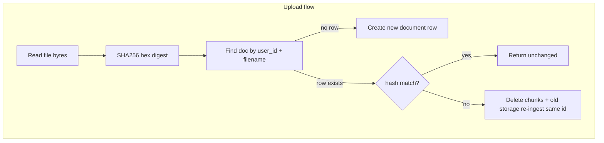
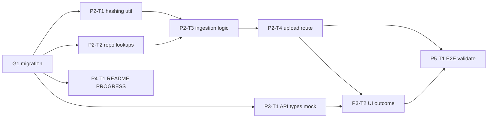

# Module 3: Record Manager

**Complexity:** ⚠️ Medium — 2–3 build/validate cycles; smaller than Module 2.

**Build via:** [.cursor/commands/build.md](../../.cursor/commands/build.md)

---

## Git commit policy

**One commit per task card** after that card’s **Validate** step passes.

- **Branch:** `module-3-record-manager` (merge to `main` when Module 3 is done)
- **Message format:** `feat(m3): P{n}-T{m} <short imperative description>`
- **Examples:**
  - `feat(m3): P1-T1 add content_hash and filename unique index`
  - `feat(m3): P2-T3 record manager skip and update ingestion`
- **Do not** batch multiple cards in one commit
- **Do not** commit `.env` files

---

## Goal

Stop naive duplicate ingestion:

| Upload scenario | Behavior |
|-----------------|----------|
| New filename | Create document, ingest (today’s flow) |
| Same filename, **same** content hash | **Skip** — return existing row, no chunk/embed work |
| Same filename, **different** hash | **Update in place** — same `id`, replace storage + chunks + embeddings |

**Out of scope:** hash-only dedup across different filenames (same bytes, two names → two rows for now), metadata filters, new chat features.

---

## Architecture



**Hash implementation** (stdlib only):

```python
import hashlib

def content_hash(content: bytes) -> str:
    return hashlib.sha256(content).hexdigest()
```

Hash is over **all file bytes**, not file size.

---

## API contract (lock before parallel UI work)

Extend `POST /api/documents/upload` response:

```json
{
  "id": "uuid",
  "filename": "notes.md",
  "status": "ready",
  "byte_size": 1234,
  "content_hash": "e3b0c442...",
  "ingest_action": "created" | "updated" | "unchanged",
  "error_message": null,
  "created_at": "...",
  "updated_at": "..."
}
```

- `unchanged`: existing doc already `ready`, same hash — **no** OpenAI embedding calls
- `updated`: re-processed in place
- `created`: new row (current behavior)

`GET /api/documents` may include optional `content_hash` (for debugging); UI only **requires** `ingest_action` on upload response.

---

## Database

New migration: `supabase/migrations/003_record_manager.sql`

```sql
alter table public.documents
  add column if not exists content_hash text;

create unique index if not exists documents_user_filename_uidx
  on public.documents (user_id, filename);

create index if not exists documents_user_content_hash_idx
  on public.documents (user_id, content_hash);
```

- **`(user_id, filename)` unique** — one logical slot per filename per user (enables in-place update)
- **`content_hash` nullable** — existing Module 2 rows stay valid; filled on next upload/update
- Apply in Supabase SQL Editor before backend cards that query by filename

**Pre-migration check:** If any user already has duplicate filenames, dedupe manually once (keep newest) or migration will fail — unlikely on a fresh dev project.

---

## How to use task cards

- Follow **Depends on** on each card; use **Parallel with** only when the gate for that track is satisfied.
- Within a parallel group, order does not matter; still **one commit per card**.
- Mark cards done in this file or mirror in `PROGRESS.md`.
- Do not skip **Validate** on any card.
- **Commit** after each card’s Validate step (see Git commit policy).

---

## Parallel execution map

### Gate G1

Migration `003` applied; `documents.content_hash` column exists.

### What can run in parallel



| Track | Cards | Parallel with | Notes |
|-------|-------|---------------|-------|
| **A — Schema** | P1-T1 | — | Single SQL file; **not** parallelizable |
| **B — Backend core** | P2-T1 | P2-T2, P3-T1, P4-T1 | After G1 |
| **B — Backend core** | P2-T2 | P2-T1, P3-T1, P4-T1 | `get_by_filename`, `clear_chunks`, storage replace helpers |
| **C — Frontend prep** | P3-T1 | P2-T1, P2-T2, P4-T1 | Types + mocked `ingest_action` in `frontend/src/lib/api.ts` |
| **D — Docs** | P4-T1 | P2-T1, P2-T2, P3-T1 | README + PROGRESS Module 3 section |
| **B — Orchestration** | P2-T3 → P2-T4 | — | **Sequential** — touches `backend/app/services/ingestion.py` |
| **C — Frontend wire** | P3-T2 → P3-T3 | — | Sequential after P2-T4 |
| **E — E2E** | P5-T1 | — | After backend + UI |

### Not parallelizable

- P1 migration (one file)
- P2-T3 → P2-T4 (single ingestion orchestration chain)
- P5-T1 full E2E

---

## Task cards

### Phase 0: Pre-flight

#### Card P0-T0: Baseline branch

| | |
| --- | --- |
| **Depends on** | — |
| **Steps** | Branch `module-3-record-manager` from clean `main` |
| **Validate** | `git status` clean |

---

### Phase 1: Schema (Track A)

#### Card P1-T1: Record manager migration

| | |
| --- | --- |
| **Depends on** | P0-T0 |
| **Steps** | Add `supabase/migrations/003_record_manager.sql` (column + indexes as above) |
| **Validate** | Column + unique index visible in Supabase; RLS still enabled |
| **Commit** | `feat(m3): P1-T1 add content_hash and filename unique index` |

---

### Phase 2: Backend (Track B)

#### Card P2-T1: Content hashing utility

| | |
| --- | --- |
| **Depends on** | G1 (P1-T1) |
| **Parallel with** | P2-T2, P3-T1, P4-T1 |
| **Steps** | Add `backend/app/services/hashing.py` with `content_hash(bytes) -> str` + tiny unit check (known vector → expected hex) |
| **Validate** | `python -c` or pytest: known bytes → stable 64-char hex |
| **Commit** | `feat(m3): P2-T1 add SHA-256 content hashing helper` |

#### Card P2-T2: Repository lookup and chunk helpers

| | |
| --- | --- |
| **Depends on** | G1 (P1-T1) |
| **Parallel with** | P2-T1, P3-T1, P4-T1 |
| **Steps** | Extend `SupabaseRepository`: `get_document_by_filename`, `delete_document_chunks`, `replace_storage_file`; include `content_hash` in create/update/list selects |
| **Validate** | Manual or script: lookup by filename returns row |
| **Commit** | `feat(m3): P2-T2 add document lookup and chunk clear helpers` |

#### Card P2-T3: Record manager ingestion logic

| | |
| --- | --- |
| **Depends on** | P2-T1, P2-T2 |
| **Steps** | Refactor `IngestionService.ingest_upload`: hash → lookup → skip / update in place / create; extract `_process_document` shared by create/update |
| **Validate** | Same file twice → no new chunks; edited file → same `id`, new chunks |
| **Commit** | `feat(m3): P2-T3 skip unchanged and update in place on upload` |

#### Card P2-T4: Upload API response

| | |
| --- | --- |
| **Depends on** | P2-T3 |
| **Steps** | Update `routes/documents.py` to return `ingest_action`, `content_hash`, `updated_at` |
| **Validate** | curl upload: `created` then `unchanged` then `updated` after edit |
| **Commit** | `feat(m3): P2-T4 expose ingest_action on upload response` |

---

### Phase 3: Frontend (Track C)

#### Card P3-T1: API types for ingest action

| | |
| --- | --- |
| **Depends on** | G1; API contract above |
| **Parallel with** | P2-T1, P2-T2, P4-T1 |
| **Steps** | Extend `DocumentRecord` / upload response in `frontend/src/lib/api.ts` with `ingest_action` |
| **Validate** | TypeScript compiles |
| **Commit** | `feat(m3): P3-T1 add ingest_action to document API types` |

#### Card P3-T2: Upload outcome UI

| | |
| --- | --- |
| **Depends on** | P2-T4, P3-T1 |
| **Steps** | Toast or inline message in `UploadDropzone` or `DocumentsPage`: Already indexed / Updated / Uploaded |
| **Validate** | Visual check in browser |
| **Commit** | `feat(m3): P3-T2 show upload outcome messages` |

#### Card P3-T3: useDocuments upload handling

| | |
| --- | --- |
| **Depends on** | P3-T2 |
| **Steps** | Adjust `useDocuments.upload`: handle `unchanged` without duplicate list rows |
| **Validate** | Re-upload does not duplicate row; edit triggers processing → ready |
| **Commit** | `feat(m3): P3-T3 handle ingest_action in useDocuments` |

---

### Phase 4: Docs (Track D)

#### Card P4-T1: README and PROGRESS

| | |
| --- | --- |
| **Depends on** | G1 |
| **Parallel with** | P2-T1, P2-T2, P3-T1 |
| **Steps** | Update `README.md` (upload behavior), `PROGRESS.md` Module 3 checklist |
| **Validate** | Docs match API contract |
| **Commit** | `docs(m3): P4-T1 document record manager behavior` |

---

### Phase 5: E2E validation

#### Card P5-T1: End-to-end validation

| | |
| --- | --- |
| **Depends on** | P2-T4, P3-T3 |
| **Validate** | See matrix below |
| **Commit** | None (validation only); update `PROGRESS.md` Module 3 → complete & validated |

| Step | Expected |
|------|----------|
| Upload `samples/rag-test-document.txt` | `created`, `ready` |
| Upload same file again | `unchanged`, no extra embedding work |
| Edit one line, re-upload same name | `updated`, same `id`, chat still cites filename |
| Chat question on doc | Still retrieves chunks |
| User B uploads same bytes | Independent row (RLS); no cross-user dedup |

---

## Files touched (summary)

| Area | Files |
|------|--------|
| DB | `supabase/migrations/003_record_manager.sql` |
| Backend | `hashing.py`, `ingestion.py`, `supabase_client.py`, `routes/documents.py` |
| Frontend | `lib/api.ts`, `useDocuments.ts`, `UploadDropzone` or `DocumentsPage` |
| Docs | `README.md`, `PROGRESS.md` |

**Unchanged:** `retrieval.py`, `chat.py`, SSE shape, chat UI.

---

## Risks / decisions (fixed for this plan)

- **Filename uniqueness** per user — deleting a doc frees the name for a new `created` upload.
- **Legacy rows** without `content_hash` — treat as “hash unknown”; first re-upload with same filename runs `updated` path.
- **Storage path** — on update, keep same `storage_path` and overwrite object (simpler than new UUID path).

---

## Agent execution order (quick reference)

1. P0 → P1 (G1)
2. **Parallel batch:** P2-T1 + P2-T2 + P3-T1 + P4-T1
3. **Sequential:** P2-T3 → P2-T4 → P3-T2 → P3-T3 → P5-T1
