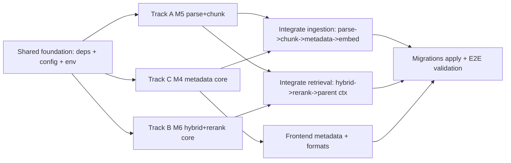

# Modules 4 + 5 + 6 — Robust Retrieval Upgrade

**Complexity:** 🔴 Complex — 3 parallel tracks + integration; expect multiple build/validate cycles.

**Build via:** [.cursor/commands/build.md](../../.cursor/commands/build.md)

**Discussion:** [Discussion/modules-4-5-6.md](../../Discussion/modules-4-5-6.md)

---

## Git commit policy

**One commit per task card** after that card’s **Validate** step passes.

- **Branch:** `module-4-5-6-retrieval` (merge to `main` when done)
- **Message format:** `feat(m456): P{n}-T{m} <short imperative description>`
- **Do not** batch multiple cards in one commit
- **Do not** commit `.env` files

---

## Overview

Build Modules 5 (multi-format parsing + structure-aware chunking), 4 (document metadata via cheap LLM), and 6 (hybrid search + Cohere reranking) as one robust retrieval upgrade. Keep the rule: never send full docs to the LLM. Cohere reranker (`COHERE_API_KEY`).

---

## Architecture

```mermaid
flowchart TB
  subgraph ingest [Ingest pipeline]
    Upload[upload] --> Hash[M3 unchanged? skip]
    Hash --> Parse[M5 docling parse: text + outline + stats]
    Parse --> Router[M5 rule router: SECTION / FIXED / PARENT_CHILD]
    Router --> Chunk[M5 chunkers -> chunk rows]
    Chunk --> Meta[M4 LLM metadata, fail-open]
    Meta --> Embed[embed children]
    Embed --> Ready[status ready]
  end
  subgraph chat [Chat retrieval]
    Q[question] --> Vec[vector search]
    Q --> Kw[keyword FTS search]
    Vec --> RRF[M6 RRF merge]
    Kw --> RRF
    RRF --> Rerank[M6 Cohere rerank top-N]
    Rerank --> Parent[expand parent context if parent_id]
    Parent --> Answer[M2 chat answer + sources]
  end
```

---

## Parallelization

- Track A (M5), Track B (M6 core), Track C (M4 core) are independent after shared foundation.
- Integration touches `ingestion.py` and `retrieval.py` (sequential).

---

## Shared foundation (do first, small)

- Add deps to [backend/requirements.txt](../../backend/requirements.txt): `docling`, `cohere`.
- Extend [backend/app/config.py](../../backend/app/config.py) `Settings` with: `metadata_extraction_enabled`, `metadata_model`, `cohere_api_key`, `rerank_model`, `rerank_enabled`, `rerank_top_n`, `hybrid_candidate_k`, `max_chunk_tokens`, `min_headings_for_section`.
- Update `.env.example` with `COHERE_API_KEY` and new tunables.

---

## Track A — Module 5: parsing + structure-aware chunking

- New `backend/app/services/parsing.py`: docling-based parser returning `text`, `outline`, `stats`. Fallback to pypdf/txt/md when docling fails; fail ingest on empty text.
- Rewrite [backend/app/services/chunking.py](../../backend/app/services/chunking.py):
  - `choose_strategy(stats)` — rules from discussion (FIXED / SECTION / parent–child inside long sections).
  - `chunk_by_sections(outline)`, `chunk_fixed(text)`.
  - Return chunk dicts with `section_title`, `heading_level`, `parent_index`, `chunk_level`.
- Migration `supabase/migrations/005_chunk_structure.sql`: `section_title`, `heading_level`, `parent_id`, `chunk_level`; nullable `embedding`; index on `parent_id`.
- Update [backend/app/services/supabase_client.py](../../backend/app/services/supabase_client.py) `insert_document_chunks` — parents first, then children.
- Expand allowed extensions in [backend/app/services/ingestion.py](../../backend/app/services/ingestion.py): `.txt`, `.md`, `.pdf`, `.docx`, `.html`.

---

## Track B — Module 6: hybrid search + Cohere rerank

- Migration `supabase/migrations/006_hybrid_search.sql`: `content_tsv` + GIN; `match_chunks_keyword` RPC; extend `match_document_chunks` (section fields, exclude null embedding).
- New `backend/app/services/reranker.py`: `CohereReranker`; fail-open without key or on error.
- New `backend/app/services/hybrid.py` (or extend retrieval): vector + keyword → RRF (k=60) → `hybrid_candidate_k`.

---

## Track C — Module 4: document metadata

- Migration `supabase/migrations/004_metadata.sql`: `documents.metadata` jsonb; optional index on `metadata->'llm'->>'doc_type'`.
- New `backend/app/services/metadata.py`: Pydantic `DocumentMetadata`; one structured `gpt-4o-mini` call; fail-open; `metadata_extraction_enabled` gate.
- Two-layer storage: `metadata.parser` (M5) + `metadata.llm` (M4).

---

## Integration — ingestion

In [backend/app/services/ingestion.py](../../backend/app/services/ingestion.py) `_process_document`:

`parse → metadata.parser → route+chunk → metadata.llm (if enabled) → embed children → insert_document_chunks → ready`

Skip entire pipeline on Module 3 `unchanged`.

---

## Integration — retrieval

In [backend/app/services/retrieval.py](../../backend/app/services/retrieval.py) `retrieve`:

`vector + keyword → RRF → Cohere rerank → expand parent context → context_blocks + sources`

---

## Frontend

- [frontend/src/lib/api.ts](../../frontend/src/lib/api.ts) — `metadata` on `DocumentRecord`; list select includes `metadata`.
- [frontend/src/components/documents/DocumentList.tsx](../../frontend/src/components/documents/DocumentList.tsx) — `doc_type` / `topics` / `summary` when present.
- [frontend/src/components/documents/UploadDropzone.tsx](../../frontend/src/components/documents/UploadDropzone.tsx) — new file types.

---

## Docs + validation

- Update [README.md](../../README.md), [PROGRESS.md](../../PROGRESS.md).
- Apply migrations `004`, `005`, `006` in Supabase SQL editor.
- E2E: mixed formats → `ready` with `metadata.parser` + `metadata.llm`; paraphrase + exact-term retrieval; parent–child context; unchanged re-upload skip; rerank fail-open.

---

## Notes / decisions

- Children embedded and searched; parents for context only (`embedding` nullable).
- Reranker is Cohere API, not chat LLM.
- LLM metadata once per new/changed document; ingest never blocked by metadata failure.
- Rule-based chunk router (no open-ended LLM chunk strategy).

---

## Task checklist

- [x] **P0** Shared foundation — deps, config, `.env.example`
- [x] **P1** Track A — parsing.py + chunking rewrite + migration 005 + supabase insert
- [x] **P2** Track B — migration 006 + reranker.py + hybrid RRF
- [x] **P3** Track C — migration 004 + metadata.py
- [x] **P4** Integrate ingestion
- [x] **P5** Integrate retrieval (hybrid + rerank + parent context)
- [x] **P6** Frontend metadata + formats
- [x] **P7** README, PROGRESS, E2E validation *(migrations + E2E require Supabase apply)*
