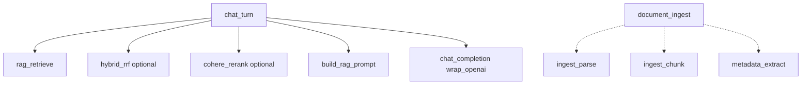

# Module 5 (post M4–6): LangSmith Full RAG Tracing

**Complexity:** ⚠️ Medium — small, focused changes across chat/retrieve/ingest; 1–2 build/validate cycles.

**Prerequisite:** [4.modules-4-5-6.md](4.modules-4-5-6.md) complete and merged (hybrid + rerank + metadata + new chunking in place).

**Build via:** [.cursor/commands/build.md](../../.cursor/commands/build.md)

---

## Git commit policy

**One commit per task card** after that card’s **Validate** step passes.

- **Branch:** `main` only (no feature branch)
- **Message format:** `feat(trace): P{n}-T{m} <short imperative description>`
- **Do not** commit `.env` files

---

## Goal

Today only **chat** `chat.completions` is traced via `wrap_openai` in [backend/app/services/openai_client.py](../../backend/app/services/openai_client.py). RAG context appears inside the `system` message but **retrieval, hybrid merge, rerank, metadata extract, and ingest** are invisible.

After this plan, one **chat turn** in LangSmith shows a **parent run** with **child spans** you control via `@traceable` (and existing `wrap_openai` for the LLM).

Ingest spans are **separate traces** (upload path), not nested under chat.

---

## What is traced vs not (you control payloads)

| Span name | `run_type` | When | Inputs (suggested) | Outputs (suggested) |
|-----------|------------|------|--------------------|---------------------|
| `chat_turn` | chain | Each `/api/chat/stream` message | `thread_id`, `query` | `source_count`, `has_context` |
| `rag_retrieve` | retriever | After M6 pipeline starts | `query` | `[{chunk_id, filename, similarity, snippet}]` |
| `hybrid_rrf` | tool | M6 merge step | `vector_count`, `keyword_count` | `candidate_count`, top ids |
| `cohere_rerank` | tool | M6 rerank step | `query`, `candidate_count` | top-N ids + scores |
| `build_rag_prompt` | chain | Before OpenAI call | `chunk_count`, `system_length` | optional redacted preview |
| `chat_completion` | llm | (auto) | full `messages` | assistant text |
| `metadata_extract` | llm | M4 ingest | `filename`, `heading_count` | `metadata.llm` or null |
| `document_ingest` | chain | Upload create/update | `filename`, `ingest_action` | `chunk_count`, `chunk_strategy` |
| `embed_query` | embedding | Optional | `query_length` | `model` (omit raw text if privacy flag) |

**Privacy:** Add `langsmith_log_chunk_text: bool = False` — when false, traces use snippets only (first 200 chars), not full chunk bodies.

---

## P0 — Tracing helper (no-op when disabled)

**Files:** new `backend/app/services/tracing.py`; touch [backend/app/config.py](../../backend/app/config.py)

| Step | Action |
|------|--------|
| 1 | `tracing_enabled()` → `langsmith_tracing and langsmith_api_key` |
| 2 | `traceable_if_enabled(**kwargs)` → returns `@traceable(...)` or identity decorator |
| 3 | `ensure_langsmith_env()` — same env setup as `openai_client._build_client` (single place) |
| 4 | Config: `langsmith_log_chunk_text: bool = False` |

**Validate:** Unit smoke — with tracing off, decorated functions run with zero LangSmith calls; with on + key, env vars set.

---

## P1 — Chat turn parent + retrieval span

**Files:** [backend/app/services/chat.py](../../backend/app/services/chat.py), [backend/app/services/retrieval.py](../../backend/app/services/retrieval.py)

| Step | Action |
|------|--------|
| 1 | `@traceable(name="chat_turn")` on `prepare_stream` (metadata: `thread_id`) |
| 2 | `@traceable(name="rag_retrieve", run_type="retriever")` on `RetrievalService.retrieve` |
| 3 | Return structured trace output: serialize `RetrievedSource` list (+ chunk ids if available from hits) |
| 4 | Respect `langsmith_log_chunk_text` for snippet vs full content in trace output |

**Validate:** Send chat with indexed doc → LangSmith shows `chat_turn` parent, `rag_retrieve` child, then OpenAI child; `rag_retrieve` outputs list filenames + scores.

---

## P2 — Hybrid + rerank spans (requires M6 code)

**Files:** [backend/app/services/hybrid.py](../../backend/app/services/hybrid.py) (or retrieval), [backend/app/services/reranker.py](../../backend/app/services/reranker.py)

| Step | Action |
|------|--------|
| 1 | `@traceable(name="hybrid_rrf", run_type="tool")` on RRF merge function |
| 2 | `@traceable(name="cohere_rerank", run_type="tool")` on `CohereReranker.rerank` — log scores, not full doc text unless flag on |
| 3 | Ensure spans nest under `chat_turn` (call order: retrieve path invoked from `prepare_stream` after parent starts) |

**Validate:** Paraphrase + exact-term queries → trace shows hybrid candidate counts and rerank top-N ordering.

---

## P3 — Prompt build span (optional but useful)

**Files:** [backend/app/config.py](../../backend/app/config.py) or small helper used by [chat.py](../../backend/app/services/chat.py)

| Step | Action |
|------|--------|
| 1 | `@traceable(name="build_rag_prompt")` wrapping `build_rag_system_prompt` usage — inputs: `len(context_blocks)`, output: `len(system_content)` |
| 2 | Do not duplicate full system text in span if `langsmith_log_chunk_text=false` (chat_completion still has full messages via wrap_openai) |

**Validate:** Trace distinguishes “0 chunks” vs “K chunks” without reading full system blob twice.

---

## P4 — Ingest + metadata spans (requires M4/M5 code)

**Files:** [backend/app/services/ingestion.py](../../backend/app/services/ingestion.py), [backend/app/services/metadata.py](../../backend/app/services/metadata.py), optionally [parsing.py](../../backend/app/services/parsing.py)

| Step | Action |
|------|--------|
| 1 | `@traceable(name="document_ingest")` on `ingest_upload` or `_process_document` (skip extra span when `unchanged`) |
| 2 | Child or inline metadata: `chunk_strategy`, `chunk_count`, `status` |
| 3 | `@traceable(name="metadata_extract", run_type="llm")` on metadata extract — use `wrap_openai` **or** traceable on extract function if separate client |
| 4 | Do not log full file bytes; log filename + hash prefix optional |

**Validate:** Upload new file → separate ingest trace with chunk count; failed metadata still shows ingest success with `llm: null`.

---

## P5 — Embeddings (optional)

**Files:** [backend/app/services/embedding.py](../../backend/app/services/embedding.py)

| Step | Action |
|------|--------|
| 1 | `@traceable(name="embed_texts", run_type="embedding")` on `embed_texts` — log `count`, `model`, total char length |
| 2 | Query embed inside retrieve can rely on this span |

**Validate:** Chat query shows short `embed_texts` child under retrieve path.

---

## P6 — Docs + env

| Step | Action |
|------|--------|
| 1 | `.env.example`: document `LANGSMITH_LOG_CHUNK_TEXT`, remind both `LANGSMITH_API_KEY` + `LANGSMITH_TRACING=true` required |
| 2 | [README.md](../../README.md) — “What appears in LangSmith” table |
| 3 | [PROGRESS.md](../../PROGRESS.md) — mark observability plan complete |

**Validate:** New developer can follow README and confirm trace shape in UI.

---

## Task checklist

- [x] **P0** Tracing helper + config flag
- [x] **P1** `chat_turn` + `rag_retrieve`
- [x] **P2** `hybrid_rrf` + `cohere_rerank`
- [x] **P3** `build_rag_prompt`
- [x] **P4** `document_ingest` + `metadata_extract`
- [x] **P5** `embed_texts` (optional)
- [x] **P6** README, `.env.example`, PROGRESS

---

## Notes

- **Do not** replace `wrap_openai` — keep it for accurate token/stream metadata on chat.
- Decorators are **no-ops** when tracing disabled (via helper), so local dev without LangSmith unchanged.
- Build this **after** M4–M6 so spans match final `retrieve()`, `reranker.py`, and `metadata.py` signatures.
- Module 7+ (web search, sub-agents): add new `@traceable` spans in the same pattern when those tools ship.
