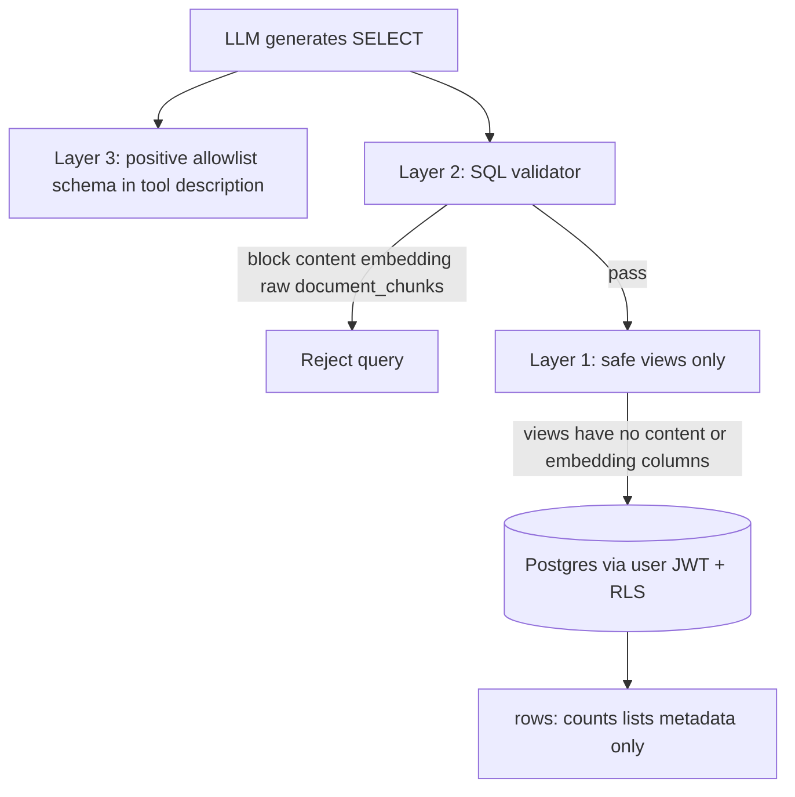
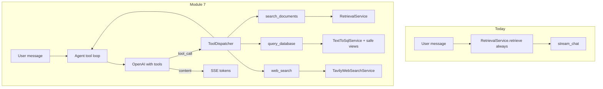
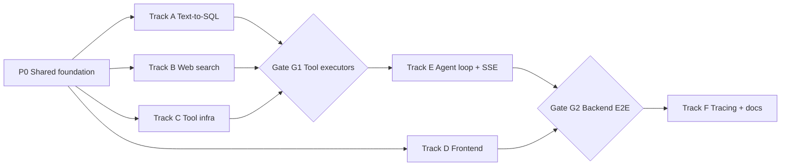

# Module 7 — Multi-Tool Agent (Parallel Build Plan)

**Complexity:** 🔴 Complex — 5 parallel tracks + 2 integration gates.

**Build via:** [.cursor/commands/build.md](../../.cursor/commands/build.md)

**Discussion:** [Discussion/modules-7-8.md](../../Discussion/modules-7-8.md)

**Branch:** `module-7-multi-tool-agent` (from clean `main`)

---

## Git commit policy

**One commit per task card** after that card's **Validate** step passes.

- **Message format:** `feat(m7): P{n}-T{m} <short imperative description>`
- Each card below includes explicit `git add` + `git commit` commands
- **Do not** batch multiple cards in one commit
- **Do not** commit `.env` files
- Migration apply cards: commit SQL file; Supabase apply is manual (no commit for apply step)

---

## Overview

Replace always-on RAG with an **LLM tool-calling loop**. Three tools:

| Tool | What it does |
|------|--------------|
| `search_documents` | Hybrid RAG over uploaded files (Modules 2–6, wrapped as tool) |
| `query_database` | Read-only SQL on **safe views** — structured facts about the user's library |
| `web_search` | Tavily fallback when docs + DB don't have the answer |

Also: SSE `tool_start` / `tool_end`, attribution in UI (doc sources, SQL query, web URLs), LangSmith spans per tool, env flags (`TEXT_TO_SQL_ENABLED`, `WEB_SEARCH_ENABLED`).

---

## Text-to-SQL design (locked from discussion)

### Why SQL exists in a RAG app

RAG searches **semantic similarity on chunk text** — great for *"What does the handbook say about sick leave?"*

RAG is **bad** for counts, lists, filters, sorts, aggregates:

- *"How many documents have I uploaded?"*
- *"Which file is largest?"*
- *"Do I have more policies or contracts?"* (needs `GROUP BY` on Module 4 metadata)

**Text-to-SQL answers structured questions about rows. RAG answers questions inside document prose.**

### Two data types — RAG vs SQL boundary

| Data type | Lives in | Example questions | Tool |
|-----------|----------|-------------------|------|
| **Unstructured** — document prose | `document_chunks.content` | "What skills are on my CV?" | `search_documents` (RAG) |
| **Structured** — rows and columns | Safe views over `documents`, chunk **metadata** | "How many docs?", "largest file?" | `query_database` (SQL) |
| **External** | — | "Latest GDPR news?" | `web_search` |

**One line:** `documents` + chunk **metadata columns** = SQL. `document_chunks.content` = RAG only.

Module 4 metadata (`doc_type`, `topics`, `summary` in `documents.metadata.llm`) **labels** documents at ingest. SQL **queries** those labels (`GROUP BY`, `COUNT`) — they complement each other; M4 does not replace SQL.

### SQL tool scope — IN vs OUT

**IN scope (v1):**

| Target | Columns / data | Example questions |
|--------|----------------|-------------------|
| `v_user_document_stats` | `filename`, `status`, `mime_type`, `byte_size`, `created_at`, `metadata`, `chunk_count` | "How many PDFs?", "Largest file?", "List policies" |
| `v_user_chunk_meta` | `chunk_index`, `section_title`, `heading_level`, `chunk_level`, `token_count`, `document_id` | "How many chunks in my CV?", "Which doc has most chunks?" |
| `v_user_chat_stats` (optional) | thread/message counts, dates | "How many chats this week?" |

**OUT of scope:**

- `document_chunks.content` — chunk **text** (RAG only)
- `document_chunks.embedding` — vectors (hybrid search only)
- Raw table `document_chunks` — too easy to hit `content` / `embedding`
- Raw table `documents` — optional block; prefer views only in v1
- `INSERT` / `UPDATE` / `DELETE` / DDL
- External ERP/CRM databases
- Replacing RAG for document Q&A

### How we ensure SQL never returns chunk text or embeddings

Three layers — **Layers 1–2 are hard enforcement; Layer 3 is routing only:**



| Layer | Mechanism | Blocks |
|-------|-----------|--------|
| **1 — Schema** | SQL tool queries **allowlisted views only**; views exclude `content` and `embedding` | Physically impossible to SELECT chunk text or vectors |
| **2 — Validator** | `sqlparse` + allowlist; SELECT-only; single statement; reject identifiers `content`, `embedding`, `document_chunks`; enforce `LIMIT` | LLM mistakes, injection attempts |
| **3 — Tool description** | **Positive allowlist only** — list allowed views + columns + use case (counts/lists/filters/aggregates). Optional one line: for document text, use `search_documents`. **No** explicit "do not query content/embedding" section — security is Layers 1–2, not LLM obedience | Wrong tool routing (soft) |

### LLM schema hint policy (post-discussion)

Give the LLM **only what it may use** — not a "do not query" block:

```text
Query ONLY these views and columns:
  v_user_document_stats → filename, status, mime_type, byte_size, metadata, chunk_count, ...
  v_user_chunk_meta     → chunk_index, section_title, token_count, document_id, ...
Use for counts, lists, filters, aggregates.
For what documents say, use search_documents.
```

- **Do not** list `content`, `embedding`, or raw table names in the tool schema — omission + validator is sufficient
- **Do not** add a "do not query" section — safe without it; shorter description, less noise
- Export `SQL_SCHEMA_HINT` / `ALLOWLIST_VIEWS` from one module (shared by tool description and validator)

**Minimal guardrails (still required even with views):**

- SELECT only
- Allowlisted views only
- RLS via logged-in user JWT (same as today)
- Row cap (default 100)
- Query timeout (default 5s)
- Show generated SQL in UI (`SqlAttribution` component)

**Not needed if views are correct:** post-hoc "don't return chunks" checks on result rows, blocking `content` by scanning result payloads.

### Example routing (E2E must verify)

| User question | Wrong tool | Right tool |
|---------------|------------|------------|
| "How many documents have I uploaded?" | RAG | SQL |
| "List my policy documents" | RAG | SQL (`metadata->llm->doc_type`) |
| "Which file is largest?" | RAG | SQL (`ORDER BY byte_size`) |
| "How many chunks does my CV have?" | RAG | SQL (join stats view) |
| "What does the handbook say about sick leave?" | SQL | RAG |
| "Search online for latest GDPR update?" | RAG / SQL | Web search (direct) |

---

## Web search design (locked from discussion)

- **Provider:** Tavily REST API (`search_depth: basic`, `max_results: 5`)
- **Free tier:** 1,000 credits/month — sufficient for 2–3 users, simple fallback (not deep research)
- **Pattern:** Retrieval API → your LLM synthesizes (not Perplexity-style pre-answered)
- **Fail-open:** no `TAVILY_API_KEY` or disabled → tool omitted; chat works with RAG + SQL
- **Web intent routing:** system prompt + `web_search` tool description — when user asks for online/current/external info (e.g. "search online", "latest news", "on the web"), use `web_search` directly; do not run RAG or SQL first

---

## v1 decisions (locked — post-review)

All recommendations confirmed before build:

| # | Topic | Decision |
|---|--------|----------|
| 1 | **SQL execution** | Backend Postgres connection (pooler `DATABASE_URL`); Python validator first; run as logged-in user via JWT/RLS — **not** PostgREST, **not** client-callable RPC |
| 2 | **RAG not automatic** | LLM chooses tools; system prompt requires `search_documents` for document-content questions; E2E tests — **no** forced always-on RAG |
| 3 | **`metadata` in views** | Keep full `metadata` jsonb on `v_user_document_stats` (doc_type, topics, summary) — summaries are short labels, not chunk text |
| 4 | **`section_title`** | Keep on `v_user_chunk_meta` (structure metadata) |
| 5 | **Validator** | Strict view allowlist; reject subqueries on non-allowlisted objects; inject `LIMIT 100`; `statement_timeout` 5s; unit tests including edge cases |
| 6 | **Tool loop** | `agent_max_tool_iterations` default **3** (not 5) |
| 7 | **Chat stats view** | Optional `v_user_chat_stats`: **counts and dates only** — no `messages.content` |
| 8 | **Direct view access** | Accept for v1 — views safe; RLS applies; users may query own stats via Supabase client |
| 9 | **Parallel build** | C-T1 creates `tool_executor.py` with stubs first; Track E owns `chat.py` only |
| 10 | **Web keyword intent** | Prompt + tool description route explicit web requests to `web_search` without RAG/SQL |

---

## Architecture



---

## Parallelization map



| Track | Agent focus | Starts after | Parallel with |
|-------|-------------|--------------|---------------|
| **P0** | Config + contracts | — | — |
| **A** | Text-to-SQL | P0 | B, C, D |
| **B** | Tavily web search | P0 | A, C, D |
| **C** | Tool schemas + RAG wrapper + dispatcher | P0 | A, B, D |
| **D** | Frontend SSE + attribution UI | P0 | A, B, C |
| **E** | OpenAI tools + ChatService loop + route | G1 | D (partial) |
| **F** | LangSmith spans + README/PROGRESS | G2 | — |

---

## P0 — Shared foundation (Gate: all tracks blocked until done)

### Card P0-T0: Baseline branch

| | |
| --- | --- |
| **Steps** | Create branch from clean `main` |
| **Validate** | `git status` clean on `module-7-multi-tool-agent` |
| **Commit** | None |

### Card P0-T1: Module 7 config flags

| | |
| --- | --- |
| **Steps** | Extend [`backend/app/config.py`](../../backend/app/config.py) `Settings`: `text_to_sql_enabled: bool = True`, `web_search_enabled: bool = True`, `tavily_api_key: str \| None`, `tavily_search_depth: str = "basic"`, `tavily_max_results: int = 5`, `database_url: str \| None` (Postgres pooler for SQL execution), `sql_row_limit: int = 100`, `sql_query_timeout_sec: int = 5`, `agent_max_tool_iterations: int = 3`. Add helpers: `text_to_sql_active()`, `web_search_active()` (key + flag, mirroring Cohere pattern). |
| **Validate** | `python -c "from app.config import get_settings; get_settings()"` in backend venv |
| **Commit** | `feat(m7): P0-T1 add module 7 config flags and helpers` |

```bash
git add backend/app/config.py
git commit -m "feat(m7): P0-T1 add module 7 config flags and helpers"
```

### Card P0-T2: Env template

| | |
| --- | --- |
| **Steps** | Update [`.env.example`](../../.env.example): `TEXT_TO_SQL_ENABLED`, `WEB_SEARCH_ENABLED`, `TAVILY_API_KEY`, `TAVILY_SEARCH_DEPTH`, `TAVILY_MAX_RESULTS`, `DATABASE_URL`, `SQL_ROW_LIMIT`, `SQL_QUERY_TIMEOUT_SEC`, `AGENT_MAX_TOOL_ITERATIONS` (default 3) |
| **Validate** | All new vars documented with comments |
| **Commit** | `feat(m7): P0-T2 document module 7 env vars in env example` |

```bash
git add .env.example
git commit -m "feat(m7): P0-T2 document module 7 env vars in env example"
```

### Card P0-T3: SSE + tool payload contract

| | |
| --- | --- |
| **Steps** | Add [`backend/app/services/tool_contracts.py`](../../backend/app/services/tool_contracts.py): Pydantic models for `ToolStartEvent`, `ToolEndEvent`, `DocumentToolResult`, `SqlToolResult`, `WebToolResult`; OpenAI tool JSON schemas for all three tools; `build_available_tools(settings)` returns enabled tools only. **`query_database` description:** positive allowlist — allowed view names + safe columns + use case (counts/lists/filters/aggregates); one optional routing line to `search_documents` for document text. **No** "do not query content/embedding" section. Share `SQL_SCHEMA_HINT` with validator allowlist constant. |
| **Validate** | Import module; `build_available_tools(get_settings())` returns 1–3 tools based on flags |
| **Commit** | `feat(m7): P0-T3 add tool schemas and SSE payload contracts` |

```bash
git add backend/app/services/tool_contracts.py
git commit -m "feat(m7): P0-T3 add tool schemas and SSE payload contracts"
```

---

## Track A — Text-to-SQL (Agent 1)

### Card A-T1: Safe views migration

| | |
| --- | --- |
| **Parallel with** | B-T1, C-T1, D-T1 |
| **Steps** | Add [`supabase/migrations/007_text_to_sql_views.sql`](../../supabase/migrations/007_text_to_sql_views.sql). **Layer 1 enforcement — views must NOT include `content` or `embedding`:** `v_user_document_stats` — `id`, `filename`, `status`, `mime_type`, `byte_size`, `created_at`, `metadata` (full jsonb per v1 decision), `chunk_count`; `v_user_chunk_meta` — `id`, `document_id`, `chunk_index`, `section_title`, `heading_level`, `chunk_level`, `token_count` only; optional `v_user_chat_stats` — thread/message **counts and dates only** (no `messages.content`). All `security invoker`, scoped to `auth.uid()`. Grant `SELECT` to `authenticated`. |
| **Validate** | Apply in Supabase SQL Editor; views exist; `\d+ v_user_chunk_meta` shows no `content`/`embedding` columns; test user gets rows |
| **Commit** | `feat(m7): A-T1 add read-only SQL views for text-to-sql` |

```bash
git add supabase/migrations/007_text_to_sql_views.sql
git commit -m "feat(m7): A-T1 add read-only SQL views for text-to-sql"
```

### Card A-T2: SQL validator

| | |
| --- | --- |
| **Depends on** | A-T1 (allowlist view names known) |
| **Parallel with** | B-T2, C-T2 |
| **Steps** | Add [`backend/app/services/sql_validator.py`](../../backend/app/services/sql_validator.py): parse with `sqlparse` (add to requirements). **Layer 2 enforcement:** SELECT-only; single statement; allowlist views only (`v_user_document_stats`, `v_user_chunk_meta`, `v_user_chat_stats`); reject references to `content`, `embedding`, `document_chunks`, `documents` (raw tables); reject write/DDL keywords; inject `LIMIT n` if missing; reject `;` multi-statement. Export `ALLOWLIST_VIEWS` constant shared with tool description. |
| **Validate** | Unit tests pass: `SELECT COUNT(*) FROM v_user_document_stats` OK; `SELECT content FROM v_user_chunk_meta` rejected; `SELECT * FROM document_chunks` rejected; `DELETE FROM ...` rejected |
| **Commit** | `feat(m7): A-T2 add read-only SQL validator with allowlist` |

```bash
git add backend/requirements.txt backend/app/services/sql_validator.py backend/tests/test_sql_validator.py
git commit -m "feat(m7): A-T2 add read-only SQL validator with allowlist"
```

### Card A-T3: Text-to-SQL service

| | |
| --- | --- |
| **Depends on** | A-T2 |
| **Steps** | Add [`backend/app/services/text_to_sql.py`](../../backend/app/services/text_to_sql.py): `TextToSqlService`; `execute(sql: str, user_id: str) -> SqlToolResult` — validate first, then run via **backend Postgres connection** (`DATABASE_URL`) with JWT session vars so **RLS applies as that user** (v1 decision — not PostgREST, not client RPC); row cap + `statement_timeout`; return `{sql, rows, row_count}`. Add small `backend/app/services/db.py` helper if needed. |
| **Validate** | Dev JWT: count query works; `SELECT content ...` raises validation error before Postgres |
| **Commit** | `feat(m7): A-T3 add text-to-sql execution service` |

```bash
git add backend/app/services/text_to_sql.py backend/app/services/supabase_client.py backend/tests/test_text_to_sql.py
git commit -m "feat(m7): A-T3 add text-to-sql execution service"
```

### Card A-T4: SQL tool executor

| | |
| --- | --- |
| **Depends on** | A-T3, P0-T3 |
| **Steps** | Add `execute_query_database(question: str, sql: str)` in [`backend/app/services/tool_executor.py`](../../backend/app/services/tool_executor.py): LLM passes generated SQL; validate + execute; format rows as JSON for tool result message; include `sql` in attribution payload for UI |
| **Validate** | Direct call with valid count SQL → rows; invalid SQL → clear error to LLM |
| **Commit** | `feat(m7): A-T4 wire query_database tool executor` |

```bash
git add backend/app/services/tool_executor.py
git commit -m "feat(m7): A-T4 wire query_database tool executor"
```

---

## Track B — Web Search (Agent 2)

### Card B-T1: Tavily dependency

| | |
| --- | --- |
| **Parallel with** | A-T1, C-T1, D-T1 |
| **Steps** | Add `httpx` (if not present) to [`backend/requirements.txt`](../../backend/requirements.txt); raw REST POST to `https://api.tavily.com/search` (no Tavily SDK) |
| **Validate** | `pip install -r requirements.txt` succeeds |
| **Commit** | `feat(m7): B-T1 add httpx for tavily web search client` |

```bash
git add backend/requirements.txt
git commit -m "feat(m7): B-T1 add httpx for tavily web search client"
```

### Card B-T2: Tavily web search service

| | |
| --- | --- |
| **Depends on** | B-T1, P0-T1 |
| **Parallel with** | A-T2, C-T2 |
| **Steps** | Add [`backend/app/services/web_search.py`](../../backend/app/services/web_search.py): `TavilyWebSearchService`; fail-open if no key or disabled; `search(query) -> list[{title, url, content}]`; `search_depth=basic`, `max_results` from settings; `@traceable_if_enabled(name="web_search", run_type="tool")` |
| **Validate** | With key: returns 3–5 results; without key: empty list, no crash |
| **Commit** | `feat(m7): B-T2 add tavily web search service with fail-open` |

```bash
git add backend/app/services/web_search.py backend/tests/test_web_search.py
git commit -m "feat(m7): B-T2 add tavily web search service with fail-open"
```

### Card B-T3: Web search tool executor

| | |
| --- | --- |
| **Depends on** | B-T2, P0-T3 |
| **Steps** | Add `execute_web_search(query: str)` to [`backend/app/services/tool_executor.py`](../../backend/app/services/tool_executor.py); format as markdown list with URLs for LLM; web URLs in attribution payload |
| **Validate** | Direct call returns formatted string with URLs |
| **Commit** | `feat(m7): B-T3 wire web_search tool executor` |

```bash
git add backend/app/services/tool_executor.py
git commit -m "feat(m7): B-T3 wire web_search tool executor"
```

---

## Track C — Tool infrastructure (Agent 3)

### Card C-T1: RAG tool wrapper

| | |
| --- | --- |
| **Parallel with** | A-T1, B-T1, D-T1 |
| **Steps** | Create [`backend/app/services/tool_executor.py`](../../backend/app/services/tool_executor.py) with **stubs** for all three executors (parallel-build decision). Implement `execute_search_documents`: calls `retrieve()`; returns context blocks + sources; **only chat path that reads `document_chunks.content`**; reuse `rag_retrieve` tracing span |
| **Validate** | Grounded doc question returns non-empty sources |
| **Commit** | `feat(m7): C-T1 wrap retrieval service as search_documents tool` |

```bash
git add backend/app/services/tool_executor.py
git commit -m "feat(m7): C-T1 wrap retrieval service as search_documents tool"
```

### Card C-T2: Tool dispatcher

| | |
| --- | --- |
| **Depends on** | C-T1; stubs OK until A-T4/B-T3 land |
| **Parallel with** | A-T2, B-T2 |
| **Steps** | Add [`backend/app/services/tool_dispatcher.py`](../../backend/app/services/tool_dispatcher.py): route `tool_name + args` → executor; respect enabled flags |
| **Validate** | Unit test: dispatch works; disabled tools omitted |
| **Commit** | `feat(m7): C-T2 add tool dispatcher registry` |

```bash
git add backend/app/services/tool_dispatcher.py backend/tests/test_tool_dispatcher.py
git commit -m "feat(m7): C-T2 add tool dispatcher registry"
```

---

## Track D — Frontend (Agent 4)

Can start after **P0-T3**. Integrates fully at **G2**.

### Card D-T1: SSE types and hook extension

| | |
| --- | --- |
| **Parallel with** | A-T1, B-T1, C-T1 |
| **Steps** | Extend [`frontend/src/hooks/useChatStream.ts`](../../frontend/src/hooks/useChatStream.ts): `onToolStart`, `onToolEnd`; parse `tool_start` / `tool_end` |
| **Validate** | TypeScript compiles |
| **Commit** | `feat(m7): D-T1 parse tool_start and tool_end SSE events` |

```bash
git add frontend/src/hooks/useChatStream.ts
git commit -m "feat(m7): D-T1 parse tool_start and tool_end SSE events"
```

### Card D-T2: Message metadata types

| | |
| --- | --- |
| **Depends on** | D-T1 |
| **Steps** | Extend [`frontend/src/hooks/useMessages.ts`](../../frontend/src/hooks/useMessages.ts): metadata — `sources`, `tools[]` (name, status, sql?, web_urls?); merge in `updateLastAssistant` |
| **Validate** | TypeScript compiles |
| **Commit** | `feat(m7): D-T2 extend message metadata for tool attribution` |

```bash
git add frontend/src/hooks/useMessages.ts
git commit -m "feat(m7): D-T2 extend message metadata for tool attribution"
```

### Card D-T3: Attribution UI components

| | |
| --- | --- |
| **Depends on** | D-T2 |
| **Parallel with** | E-T1 |
| **Steps** | Add `ToolActivity.tsx`, `SqlAttribution.tsx` (show generated SQL — trust/transparency from discussion), `WebSourceCitations.tsx`; wire in [`MessageBubble.tsx`](../../frontend/src/components/chat/MessageBubble.tsx) |
| **Validate** | Fixture render: SQL block, URL chips, doc sources all visible |
| **Commit** | `feat(m7): D-T3 add tool activity and sql web attribution UI` |

```bash
git add frontend/src/components/chat/ToolActivity.tsx frontend/src/components/chat/SqlAttribution.tsx frontend/src/components/chat/WebSourceCitations.tsx frontend/src/components/chat/MessageBubble.tsx
git commit -m "feat(m7): D-T3 add tool activity and sql web attribution UI"
```

### Card D-T4: ChatPage streaming wiring

| | |
| --- | --- |
| **Depends on** | D-T3, **G2** |
| **Steps** | Update [`frontend/src/pages/ChatPage.tsx`](../../frontend/src/pages/ChatPage.tsx): wire tool callbacks; `ToolActivity` during stream |
| **Validate** | SQL / doc / web questions show correct attribution |
| **Commit** | `feat(m7): D-T4 wire chat page to tool streaming events` |

```bash
git add frontend/src/pages/ChatPage.tsx
git commit -m "feat(m7): D-T4 wire chat page to tool streaming events"
```

---

## Track E — Agent loop + SSE integration (Agent 5)

**Gate G1:** A-T4, B-T3, C-T2 complete before E-T1.

### Card E-T1: OpenAI tool-calling client

| | |
| --- | --- |
| **Depends on** | G1, P0-T3 |
| **Steps** | Extend [`backend/app/services/openai_client.py`](../../backend/app/services/openai_client.py): `create_chat_with_tools`, `stream_chat_final`; handle `tool_calls` |
| **Validate** | Mocked OpenAI test: tool_call parsed |
| **Commit** | `feat(m7): E-T1 extend openai client for tool calling` |

```bash
git add backend/app/services/openai_client.py backend/tests/test_openai_tools.py
git commit -m "feat(m7): E-T1 extend openai client for tool calling"
```

### Card E-T2: ChatService agent loop

| | |
| --- | --- |
| **Depends on** | E-T1, C-T2 |
| **Steps** | Refactor [`backend/app/services/chat.py`](../../backend/app/services/chat.py): remove always-on `retrieve()`; extend base `system_prompt` with tool-routing rules (document content → `search_documents`; library stats → `query_database`; online/external/"search online" → `web_search`); tool loop up to `agent_max_tool_iterations` (3); accumulate attribution metadata |
| **Validate** | Doc / SQL / web prompts route to correct tools |
| **Commit** | `feat(m7): E-T2 replace always-on rag with agent tool loop` |

```bash
git add backend/app/services/chat.py
git commit -m "feat(m7): E-T2 replace always-on rag with agent tool loop"
```

### Card E-T3: SSE tool events in chat route

| | |
| --- | --- |
| **Depends on** | E-T2 |
| **Steps** | Update [`backend/app/routes/chat.py`](../../backend/app/routes/chat.py): `tool_start` / `tool_end`; keep `sources` on `search_documents`; persist metadata |
| **Validate** | curl SSE: tool events then tokens |
| **Commit** | `feat(m7): E-T3 emit tool SSE events from chat stream route` |

```bash
git add backend/app/routes/chat.py
git commit -m "feat(m7): E-T3 emit tool SSE events from chat stream route"
```

**Gate G2:** E-T3 + D-T3 done → D-T4 + F-track.

---

## Track F — Tracing + docs (after G2)

### Card F-T1: LangSmith tool spans

| | |
| --- | --- |
| **Steps** | Extend [`backend/app/services/tracing.py`](../../backend/app/services/tracing.py): processors for `query_database`, `web_search` |
| **Validate** | LangSmith shows nested tool spans |
| **Commit** | `feat(m7): F-T1 add langsmith processors for module 7 tools` |

```bash
git add backend/app/services/tracing.py backend/tests/test_tracing.py
git commit -m "feat(m7): F-T1 add langsmith processors for module 7 tools"
```

### Card F-T2: README and PROGRESS

| | |
| --- | --- |
| **Steps** | Update [`README.md`](../../README.md), [`PROGRESS.md`](../../PROGRESS.md), [`.github/RELEASE_v4.md`](../../.github/RELEASE_v4.md) — include Text-to-SQL scope + RAG boundary summary |
| **Validate** | Docs match implementation |
| **Commit** | `feat(m7): F-T2 document module 7 multi-tool agent` |

```bash
git add README.md PROGRESS.md .github/RELEASE_v4.md
git commit -m "feat(m7): F-T2 document module 7 multi-tool agent"
```

---

## E2E validation checklist (after G2)

### Tool routing

1. *"What does my CV say about Python?"* → `search_documents` → source chips (not SQL)
2. *"How many documents have I uploaded?"* → `query_database` → SQL shown, correct count
3. *"Latest EU AI Act news?"* → `web_search` → URL chips (`TAVILY_API_KEY` required)

### Text-to-SQL boundary (must pass)

4. `SELECT content FROM v_user_chunk_meta` → **validator rejects** (column blocked)
5. `SELECT * FROM document_chunks` → **validator rejects** (raw table blocked)
6. `SELECT embedding FROM ...` → **validator rejects**
7. Views have no `content` / `embedding` columns (schema inspection)
8. User B cannot count User A's documents (RLS)

### Fail-open + security

9. No Tavily key → web tool disabled; RAG + SQL still work
10. README security smoke test still passes

---

## Agent assignment summary

| Agent | Cards |
|-------|-------|
| **Lead / P0** | P0-T0 → P0-T1 → P0-T2 → P0-T3 |
| **Agent SQL** | A-T1 → A-T2 → A-T3 → A-T4 |
| **Agent Web** | B-T1 → B-T2 → B-T3 |
| **Agent Tools** | C-T1 → C-T2 |
| **Agent Frontend** | D-T1 → D-T2 → D-T3 → (G2) → D-T4 |
| **Agent Integration** | E-T1 → E-T2 → E-T3 |
| **Agent Docs** | F-T1 → F-T2 |

**Merge conflict hotspots:** `tool_executor.py` (A-T4, B-T3, C-T1), `chat.py` (E-T2), `ChatPage.tsx` (D-T4).

---

## Task checklist

- [ ] **P0** Shared foundation (config, env, tool contracts)
- [ ] **A** Text-to-SQL (views, validator, service, executor)
- [ ] **B** Web search (Tavily service, executor)
- [ ] **C** Tool infra (RAG wrapper, dispatcher)
- [ ] **D** Frontend (SSE, attribution UI, ChatPage)
- [ ] **G1** All tool executors ready
- [ ] **E** Agent loop + SSE integration
- [ ] **G2** E2E validation (routing + SQL boundary tests)
- [ ] **F** LangSmith + docs
