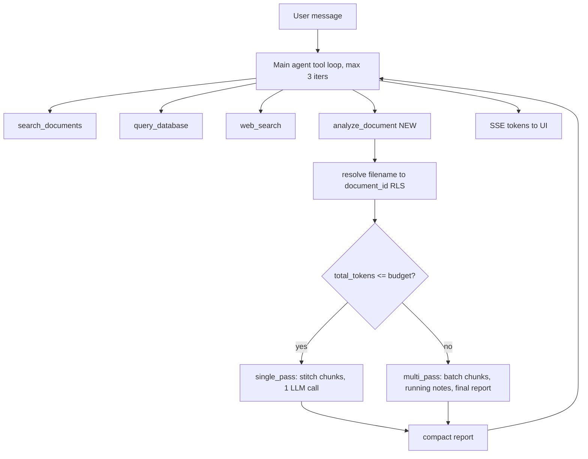
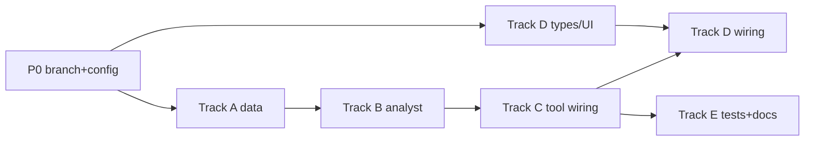

# Module 8 - Sub-Agents (Document Analyst)

**Complexity:** 🔴 Complex - new service + tool wiring + SSE/UI + isolation rules.

**Build via:** [.cursor/commands/build.md](../../.cursor/commands/build.md)

**Discussion:** [Discussion/modules-7-8.md](../../Discussion/modules-7-8.md)

**Branch:** `module-8-sub-agents` (from current `module-7-multi-tool-agent`)

---

## Locked design decisions (from discussion)

- **One new main-agent tool: `analyze_document`.** The main agent keeps `search_documents`, `query_database`, `web_search`. The sub-agent does NOT get those tools.
- **Sub-agent = isolated context + more text than RAG**, not a second full agent hierarchy.
- **Token-aware routing inside the tool:** `single_pass` if the doc fits the budget, else internal `multi_pass` map-reduce. A 400-page book stays ONE sub-agent with internal batches - never many sibling sub-agents.
- **`SUB_AGENT_MAX_PER_TURN = 2`** - a ceiling, not a default:
  - Most turns: no sub-agent (RAG handles normal questions).
  - Whole-document task (summarize/deep read one file): 1 sub-agent.
  - Compare / contrast / "both" across two files: 2 sub-agents.
- **No nested sub-agents** (one level only).
- Sub-agent returns a **compact report** (~2k tokens), never the full document, back to the main agent.

---

## Git commit policy

**One commit per task card** after its **Validate** step passes.

- **Message format:** `feat(m8): {Track}-T{n} <short imperative description>`
- Do NOT batch cards; do NOT commit `.env`.
- Migration card commits the SQL file; Supabase apply is manual (no commit for apply).

---

## Parallelization map

After P0 completes: **Track A and Track D-types/UI scaffolding can start in parallel** (different files). **Track B depends on A-T3** (chunk/filename helpers). **Track C depends on B-T2 + C-T1**. **Track E (tests/docs) runs last.** Conflict hotspots (`tool_executor.py`, `tool_dispatcher.py`, `chat.py`, `tool_contracts.py`, `ToolActivity.tsx`) should be touched by one track at a time.

---

## P0 - Foundation

### P0-T0: Branch
- **Steps:** `git checkout -b module-8-sub-agents` from `module-7-multi-tool-agent`.
- **Validate:** `git status` clean on new branch.
- **Commit:** none.

### P0-T1: Config flags
- **Steps:** Extend [backend/app/config.py](../../backend/app/config.py) `Settings`: `sub_agent_enabled: bool = True`, `sub_agent_max_per_turn: int = 2`, `sub_agent_context_token_budget: int = 80000`, `sub_agent_internal_max_passes: int = 8`, `sub_agent_output_max_tokens: int = 2000`, `sub_agent_model: str = "gpt-4o-mini"`. Add helper `sub_agent_active()` (mirrors `web_search_active`).
- **Validate:** `python -c "from app.config import get_settings; get_settings()"` in venv.
- **Commit:** `feat(m8): P0-T1 add sub-agent config flags and helper`.

### P0-T2: Env template
- **Steps:** Add `SUB_AGENT_ENABLED`, `SUB_AGENT_MAX_PER_TURN`, `SUB_AGENT_CONTEXT_TOKEN_BUDGET`, `SUB_AGENT_INTERNAL_MAX_PASSES`, `SUB_AGENT_OUTPUT_MAX_TOKENS`, `SUB_AGENT_MODEL` to [.env.example](../../.env.example) with comments.
- **Validate:** all new vars documented.
- **Commit:** `feat(m8): P0-T2 document sub-agent env vars`.

---

## Track A - Data layer (token-aware fit check)

### A-T1: total_token_count migration
- **Steps:** Add `supabase/migrations/008_document_token_count.sql`: `alter table public.documents add column if not exists total_token_count int;` plus a backfill `update` summing `document_chunks.token_count` per document. Update `v_user_document_stats` (from [supabase/migrations/007_text_to_sql_views.sql](../../supabase/migrations/007_text_to_sql_views.sql)) to expose `total_token_count` so SQL/agent can read it.
- **Validate:** apply in Supabase SQL Editor; column present; existing docs backfilled.
- **Commit:** `feat(m8): A-T1 add total_token_count column and backfill`.

### A-T2: Ingest writes token total
- **Steps:** In [backend/app/services/ingestion.py](../../backend/app/services/ingestion.py), sum `chunk["token_count"]` for embeddable chunks and write `total_token_count` in the final `update_document` call (near line 264).
- **Validate:** re-upload a sample doc; `total_token_count` populated.
- **Commit:** `feat(m8): A-T2 persist total_token_count on ingest`.

### A-T3: Repo read helpers
- **Steps:** In [backend/app/services/supabase_client.py](../../backend/app/services/supabase_client.py): add `list_document_chunks(document_id)` returning `content`, `chunk_index`, `token_count`, `chunk_level` ordered by `chunk_index` (parents only, exclude child duplicates - or full text, pick one ordering and document it); add `find_documents_by_filename(filename)` (case-insensitive, RLS-scoped) returning `id`, `filename`, `total_token_count`, `status`.
- **Validate:** unit/manual: helpers return rows for a known doc under the user's JWT.
- **Commit:** `feat(m8): A-T3 add chunk list and filename lookup repo methods`.

---

## Track B - DocumentAnalystService (the sub-agent)

### B-T1: Token budget + batching helpers
- **Steps:** New `backend/app/services/sub_agent.py` (or `document_analyst.py`). Reuse `estimate_tokens` from [backend/app/services/parsing.py](../../backend/app/services/parsing.py). Add `fits_budget(total, settings)` and `batch_chunks(chunks, batch_token_budget)`.
- **Validate:** unit tests for batching boundaries and fit decision.
- **Commit:** `feat(m8): B-T1 add token budget and chunk batching helpers`.

### B-T2: Analyst service (single + multi pass)
- **Steps:** `DocumentAnalystService.analyze(document_id, filename, task, user_jwt) -> AnalystReport`. Resolve chunks via A-T3; if `total <= budget` run `_single_pass` (stitch chunks -> one `sub_agent_model` call); else `_multi_pass` map-reduce: iterate batches updating running notes (cap at `sub_agent_internal_max_passes`), then a final reduce call producing a structured report capped at `sub_agent_output_max_tokens`. Return `{report, mode, passes, document_id, filename}`. Uses its own OpenAI client (no main-agent tools).
- **Validate:** unit test with mocked OpenAI: small doc -> single_pass; large doc -> multi_pass with bounded passes.
- **Commit:** `feat(m8): B-T2 implement document analyst single and multi pass`.

---

## Track C - Tool wiring + agent loop

### C-T1: Tool contract
- **Steps:** In [backend/app/services/tool_contracts.py](../../backend/app/services/tool_contracts.py) add `_analyze_document_tool()` (args: `filename` string, `task` string; description: use for whole-document summary / deep read / compare, NOT for pinpoint facts which use `search_documents`). Add `AnalystToolResult` model. Append to `build_available_tools` when `settings.sub_agent_active()`.
- **Validate:** `build_available_tools` includes `analyze_document` only when enabled.
- **Commit:** `feat(m8): C-T1 add analyze_document tool schema`.

### C-T2: Executor
- **Steps:** In [backend/app/services/tool_executor.py](../../backend/app/services/tool_executor.py) add `execute_analyze_document(filename, task, user_jwt)`: resolve filename (A-T3); if not found/ambiguous return a clear error listing available filenames; else call `DocumentAnalystService`; return report dict. In [backend/app/services/tool_dispatcher.py](../../backend/app/services/tool_dispatcher.py) register `analyze_document` in `KNOWN_TOOLS` and dispatch (gate on `sub_agent_active()`, require `user_jwt`).
- **Validate:** direct dispatch returns a report for a known doc; unknown filename returns helpful error.
- **Commit:** `feat(m8): C-T2 wire analyze_document executor and dispatcher`.

### C-T3: Agent loop integration + per-turn cap + routing
- **Steps:** In [backend/app/services/chat.py](../../backend/app/services/chat.py): extend `_AGENT_ROUTING_PROMPT` with `analyze_document` guidance (whole-doc/compare -> analyze_document; specific facts -> search_documents). Enforce `sub_agent_max_per_turn`: count `analyze_document` calls in the turn; if exceeded, reject the extra call with a tool error ("pick the two most relevant documents") instead of executing. Record analyst attribution in `_tool_meta_from_result` (`mode`, `passes`, `document_id`, `filename`).
- **Validate:** prompt routes a "summarize whole doc" to analyze_document; a 3rd analyze call in one turn is blocked.
- **Commit:** `feat(m8): C-T3 integrate sub-agent into chat loop with per-turn cap`.

---

## Track D - SSE + Frontend

### D-T1: Sub-agent progress SSE (optional event)
- **Steps:** Add a `subagent_progress` event (`{pass, total_passes, mode}`) emitted from the analyst via a callback through `ChatService` -> [backend/app/routes/chat.py](../../backend/app/routes/chat.py) (mirror existing `tool_start`/`tool_end` handling). Keep `tool_start`/`tool_end` for `analyze_document` as-is.
- **Validate:** curl SSE on a large doc shows progress events then tokens.
- **Commit:** `feat(m8): D-T1 emit sub-agent progress SSE events`.

### D-T2: Frontend stream + metadata types
- **Steps:** Extend [frontend/src/hooks/useChatStream.ts](../../frontend/src/hooks/useChatStream.ts) with `onSubAgentProgress`. Extend `ToolMeta` in [frontend/src/hooks/useMessages.ts](../../frontend/src/hooks/useMessages.ts) with optional `mode`, `passes`, `filename`.
- **Validate:** `tsc --noEmit` clean.
- **Commit:** `feat(m8): D-T2 parse sub-agent progress and metadata`.

### D-T3: Tool activity UI (single chip, not sprawl)
- **Steps:** Update [frontend/src/components/chat/ToolActivity.tsx](../../frontend/src/components/chat/ToolActivity.tsx) to show `analyze_document` with live progress (e.g. `analyzing handbook.pdf (3/5)`), one chip per document - two chips max for compare. Wire progress callback in [frontend/src/pages/ChatPage.tsx](../../frontend/src/pages/ChatPage.tsx).
- **Validate:** fixture render shows progress label; compare shows two chips.
- **Commit:** `feat(m8): D-T3 show sub-agent progress in tool activity UI`.

---

## Track E - Tracing, tests, docs

### E-T1: LangSmith spans
- **Steps:** In [backend/app/services/tracing.py](../../backend/app/services/tracing.py) add a `document_analyze` parent span with child spans per internal pass; decorate analyst methods with `@traceable_if_enabled`.
- **Validate:** LangSmith shows nested analyst spans when tracing on.
- **Commit:** `feat(m8): E-T1 add langsmith spans for document analyst`.

### E-T2: Tests
- **Steps:** Add `backend/tests/test_sub_agent.py`: budget routing (single vs multi), pass cap, per-turn cap, filename-not-found error, RLS (user B cannot analyze user A's doc).
- **Validate:** `pytest` green.
- **Commit:** `feat(m8): E-T2 add sub-agent unit tests`.

### E-T3: Docs + release notes
- **Steps:** Update [README.md](../../README.md), [PROGRESS.md](../../PROGRESS.md) (Module 8 section + checklist), add `.github/RELEASE_v5.md`.
- **Validate:** docs match implementation.
- **Commit:** `feat(m8): E-T3 document module 8 sub-agents`.

---

## E2E validation checklist

1. "Summarize my whole handbook" -> 1 `analyze_document`, `single_pass` (small) or `multi_pass` (large), progress chip.
2. "Compare contract A vs contract B" -> 2 `analyze_document` calls, then synthesized answer.
3. Normal fact question -> `search_documents` (no sub-agent).
4. Library stats -> `query_database` (no sub-agent).
5. 3rd analyze call in one turn -> blocked by per-turn cap.
6. Unknown filename -> helpful error listing available docs.
7. RLS: user B cannot analyze user A's document.
8. `SUB_AGENT_ENABLED=false` -> tool omitted; chat still works.

---

## Track / commit summary

- **P0:** branch, config, env.
- **A:** token_count migration, ingest write, repo helpers.
- **B:** analyst service (single + multi pass).
- **C:** tool schema, executor/dispatcher, chat loop + per-turn cap.
- **D:** SSE progress, frontend metadata + UI.
- **E:** tracing, tests, docs.

**Conflict hotspots:** `tool_executor.py`, `tool_dispatcher.py`, `chat.py`, `tool_contracts.py`, `ToolActivity.tsx`.

---

## Task checklist

- [ ] **P0** Branch, config flags, env vars
- [ ] **A** Data layer (token_count migration, ingest write, repo helpers)
- [ ] **B** DocumentAnalystService (single + multi pass)
- [ ] **C** Tool wiring (schema, executor/dispatcher, chat loop + per-turn cap)
- [ ] **D** SSE progress + frontend metadata + UI
- [ ] **E** LangSmith spans, tests, docs
