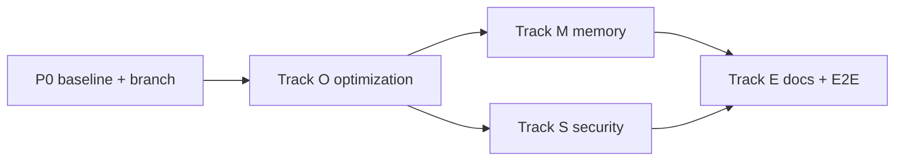

# Phase 9 — Optimization, Memory & Security

**Complexity:** 🔴 Complex — three pillars; measure-first optimization, then memory model changes, then security hardening.

**Build via:** [.cursor/commands/build.md](../../.cursor/commands/build.md)

**Branch:** `phase-9-optimization-memory-security` (from clean `main`)

**Execution order (locked):** This phase **starts with optimization**. Do not begin Memory or Security tracks until Track O baseline + first wins are in place.

```text
P0 (baseline) → Track O (optimization) → Track M (memory) + Track S (security) in parallel
```

---

## Why this phase

Modules 1–8 delivered a full agentic RAG app. Phase 9 makes it **production-ready**: faster and cheaper (optimization), smarter over long threads (memory), and harder to abuse (security).

Current gaps to address:

| Area | Today | Phase 9 target |
|------|-------|----------------|
| **Optimization** | No baseline metrics; single-shot embed; full history up to 50 msgs | Profiled hot paths; batched/cached ops; tunable retrieval; documented perf budget |
| **Memory** | Last N messages resent verbatim (`max_history_messages=50`) | Token-budget window + rolling thread summary; UI shows when summary is active |
| **Security** | RLS + SQL allowlist + upload size cap | Rate limits, upload/MIME hardening, RLS audit, prompt-injection guardrails, security headers |

---

## Git commit policy

**One commit per task card** after its **Validate** step passes.

- **Message format:** `feat(p9): {Track}-T{n} <short imperative description>`
- Do NOT batch cards; do NOT commit `.env`.
- Migration cards commit the SQL file; Supabase apply is manual.

---

## Parallelization map



**Conflict hotspots:** `chat.py`, `config.py`, `supabase_client.py`, `ingestion.py`, `main.py` — one track at a time per file.

---

## P0 — Foundation (start here)

### P0-T0: Branch
- **Steps:** `git checkout -b phase-9-optimization-memory-security` from `main`.
- **Validate:** `git status` clean on new branch.
- **Commit:** none.

### P0-T1: Baseline benchmark script
- **Steps:** Add `Scripts/benchmark_p9.py` that times (with simple stdout report):
  1. Ingest `samples/rag-test-document.txt` (cold + warm re-upload unchanged)
  2. One RAG chat turn (`search_documents`)
  3. One SQL stats turn (`query_database`, skip if no `DATABASE_URL`)
  4. One sub-agent turn (`analyze_document`, skip if no ready doc)
- Record wall-clock per step; optional LangSmith link if tracing on.
- **Validate:** Script runs without error; prints timing table.
- **Commit:** `feat(p9): P0-T1 add phase 9 baseline benchmark script`

### P0-T2: Config scaffold
- **Steps:** Extend [backend/app/config.py](../../backend/app/config.py) with Phase 9 flags (defaults preserve current behavior):
  - `embed_batch_size: int = 64`
  - `history_token_budget: int = 12_000` (0 = disabled, use message count only)
  - `thread_summary_enabled: bool = False`
  - `thread_summary_model: str = "gpt-4o-mini"`
  - `rate_limit_chat_per_min: int = 0` (0 = disabled)
  - `rate_limit_upload_per_min: int = 0`
- Document all new keys in [.env.example](../../.env.example).
- **Validate:** `python -c "from app.config import get_settings; get_settings()"` in venv.
- **Commit:** `feat(p9): P0-T2 add phase 9 config flags`

---

## Track O — Optimization (**first delivery track**)

Goal: reduce latency and token/API cost on the hottest paths without changing user-visible behavior.

### O-T1: Embedding batching
- **Steps:** In [backend/app/services/embedding.py](../../backend/app/services/embedding.py), split `embed_texts` into batches of `settings.embed_batch_size`; preserve order; keep LangSmith span.
- **Validate:** Existing ingest still reaches `ready`; benchmark script shows ingest time ≤ baseline or document why not.
- **Commit:** `feat(p9): O-T1 batch embedding API calls`

### O-T2: Skip redundant work on unchanged ingest
- **Steps:** Audit [backend/app/services/ingestion.py](../../backend/app/services/ingestion.py): ensure `unchanged` path exits before parse/chunk/embed (record manager already hashes — verify no wasted LLM/metadata calls).
- **Validate:** Re-upload unchanged file → no embedding API calls (mock or LangSmith span count).
- **Commit:** `feat(p9): O-T2 short-circuit unchanged ingest pipeline`

### O-T3: Retrieval candidate tuning + query-embed reuse
- **Steps:**
  - In [backend/app/services/retrieval.py](../../backend/app/services/retrieval.py), avoid double-embedding when hybrid path already has query vector.
  - Add env `HYBRID_CANDIDATE_K` tuning notes to README; consider lowering default only if benchmark improves quality/latency tradeoff (document decision).
- **Validate:** RAG chat still returns sources; hybrid span shows single embed per turn.
- **Commit:** `feat(p9): O-T3 dedupe query embedding in retrieval path`

### O-T4: Chat agent loop efficiency
- **Steps:** In [backend/app/services/chat.py](../../backend/app/services/chat.py):
  - Trim tool results stored in the message loop to compact JSON (drop large raw payloads already persisted in message metadata).
  - Ensure parallel `analyze_document` stays; no regression.
- **Validate:** Tool-calling E2E still works; token usage in LangSmith ≤ baseline on a 2-tool turn.
- **Commit:** `feat(p9): O-T4 compact tool results in agent message loop`

### O-T5: DB / index audit
- **Steps:** Review migrations `002`, `006`, `008` for missing indexes on hot filters (`user_id`, `document_id`, `thread_id`, FTS). Add `supabase/migrations/009_perf_indexes.sql` only if EXPLAIN or docs justify it.
- **Validate:** Migration SQL applies cleanly; hybrid RPC latency stable or improved in benchmark.
- **Commit:** `feat(p9): O-T5 add performance indexes migration`

### O-T6: Optimization report
- **Steps:** Add `Discussion/phase-9-optimization-report.md` with before/after benchmark table and recommended production env values.
- **Validate:** Report references real numbers from P0-T1 script.
- **Commit:** `feat(p9): O-T6 document optimization baseline and wins`

**Track O gate:** Benchmark script re-run; at least two metrics improved or explicitly documented as bounded by external API.

---

## Track M — Memory (after Track O gate)

Goal: long threads stay coherent without sending full verbatim history every turn.

### M-T1: Thread summary schema
- **Steps:** Add `supabase/migrations/010_thread_memory.sql`:
  - `threads.summary text` (nullable)
  - `threads.summary_through_message_id uuid` (nullable FK → messages)
  - RLS unchanged (inherits thread ownership)
- **Validate:** Migration applies; existing threads unaffected.
- **Commit:** `feat(p9): M-T1 thread summary migration`

### M-T2: History token budget
- **Steps:** In [backend/app/services/supabase_client.py](../../backend/app/services/supabase_client.py) + [backend/app/services/chat.py](../../backend/app/services/chat.py):
  - When `history_token_budget > 0`, load messages newest-first until budget exhausted (rough token estimate: `len/4` or reuse chunk token helper).
  - Fall back to `max_history_messages` cap.
- **Validate:** Unit test: 100 short messages → only recent subset sent; older messages still in DB.
- **Commit:** `feat(p9): M-T2 token-budget chat history window`

### M-T3: Rolling thread summary
- **Steps:** When `thread_summary_enabled` and history exceeds budget:
  1. Summarize messages not in the window (compact bullet summary).
  2. Store in `threads.summary`; inject as system-side context block in `_build_messages`.
  3. Update summary incrementally (don't re-summarize entire thread every turn).
- **Validate:** Long thread test: model answers question about early message via summary; LangSmith shows summary block not full early history.
- **Commit:** `feat(p9): M-T3 rolling thread summary for long conversations`

### M-T4: Frontend memory indicator (optional UX)
- **Steps:** In chat UI, show subtle chip when summary is active ("Long thread — earlier messages summarized").
- **Validate:** Chip appears on long thread; absent on short thread.
- **Commit:** `feat(p9): M-T4 show thread summary indicator in chat UI`

---

## Track S — Security (after Track O gate; parallel with Track M)

Goal: defense in depth beyond RLS — abuse resistance and safer defaults.

### S-T1: Rate limiting middleware
- **Steps:** Add [backend/app/middleware/rate_limit.py](../../backend/app/middleware/rate_limit.py):
  - In-memory sliding window per user ID (JWT sub) on `/api/chat` and document upload.
  - Controlled by `rate_limit_chat_per_min` / `rate_limit_upload_per_min` (0 = off).
  - Return `429` with `Retry-After`.
- Wire in [backend/app/main.py](../../backend/app/main.py).
- **Validate:** Unit test with limit=2 → third request 429; limit=0 → no blocking.
- **Commit:** `feat(p9): S-T1 per-user rate limiting on chat and upload`

### S-T2: Upload hardening
- **Steps:** In [backend/app/routes/documents.py](../../backend/app/routes/documents.py) + ingestion:
  - Strict extension ↔ MIME allowlist (reject mismatch).
  - Reject empty files and path traversal in filename (`../`, null bytes).
  - Cap filename length.
- **Validate:** Tests: bad MIME, `../evil.pdf`, empty file → 400.
- **Commit:** `feat(p9): S-T2 harden document upload validation`

### S-T3: SQL + RLS audit tests
- **Steps:**
  - Expand [backend/tests/test_sql_validator.py](../../backend/tests/test_sql_validator.py): subqueries, CTEs referencing blocked tables, multiple statements.
  - Add `backend/tests/test_rls_smoke.py` (marked `@pytest.mark.integration`, skip without env): User A/B cannot read each other's threads, documents, chunks.
- **Validate:** `pytest backend/tests/test_sql_validator.py` passes; integration tests skip cleanly without credentials.
- **Commit:** `feat(p9): S-T3 expand SQL validator and RLS smoke tests`

### S-T4: Prompt-injection guardrails
- **Steps:** Extend agent system prompt in [backend/app/services/chat.py](../../backend/app/services/chat.py):
  - Instruct model to treat retrieved/tool content as untrusted data, not instructions.
  - Never exfiltrate secrets or system prompt.
- Add optional `sanitize_retrieved_context()` strip of common injection patterns (minimal — no over-engineering).
- **Validate:** Test with doc containing "ignore previous instructions" → answer stays grounded, no policy leak.
- **Commit:** `feat(p9): S-T4 prompt-injection guardrails for RAG and tools`

### S-T5: Security headers + CORS guidance
- **Steps:** Add middleware for `X-Content-Type-Options`, `X-Frame-Options`, `Referrer-Policy` on API responses.
  - Document production `CORS_ORIGINS` (no wildcard with credentials) in README.
- **Validate:** `curl -I /health` shows headers; README updated.
- **Commit:** `feat(p9): S-T5 security headers and CORS production notes`

### S-T6: Security checklist doc
- **Steps:** Add `Discussion/phase-9-security-checklist.md`: RLS tables, storage policies, SQL allowlist views, rate limits, secrets handling, Supabase dashboard settings.
- **Validate:** Checklist covers all tables from migrations 001–010.
- **Commit:** `feat(p9): S-T6 security checklist documentation`

---

## Track E — Integration & ship

### E-T1: Full test suite + benchmark regression
- **Steps:** Run `pytest backend/tests/` and `Scripts/benchmark_p9.py`; fix regressions.
- **Validate:** All unit tests pass; benchmark documents Phase 9 deltas.
- **Commit:** `feat(p9): E-T1 phase 9 integration validation`

### E-T2: PROGRESS, README, release notes
- **Steps:** Mark Phase 9 complete in [PROGRESS.md](../../PROGRESS.md); update [README.md](../../README.md) env table; draft `.github/RELEASE_v6.md`.
- **Validate:** Docs match implemented flags and migration numbers.
- **Commit:** `feat(p9): E-T2 document phase 9 optimization memory security`

---

## Success criteria

- [ ] **Optimization first:** Track O complete and benchmarked before M/S land
- [ ] Ingest and chat latency/token usage measured and improved or bounded with docs
- [ ] Long threads use summary + token budget without losing early context
- [ ] Rate limits, upload validation, SQL/RLS tests, and security headers in place
- [ ] No regression in Modules 1–8 E2E flows (chat, ingest, tools, sub-agent)

---

## Out of scope (Phase 9)

- Multi-tenant admin, billing, external connectors
- Redis-backed rate limiting (in-memory is sufficient for single-instance v1)
- Full OWASP pen-test or WAF deployment
- Vector index algorithm changes (HNSW params) unless benchmark proves need
