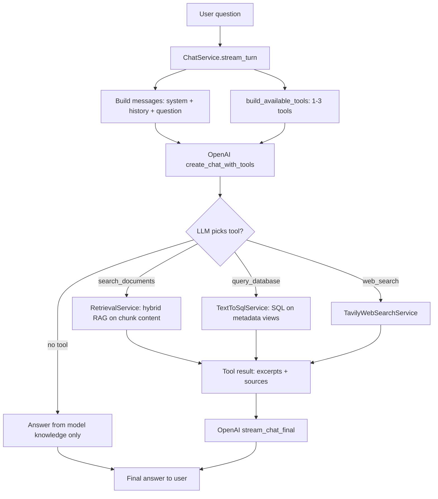
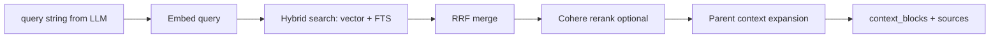
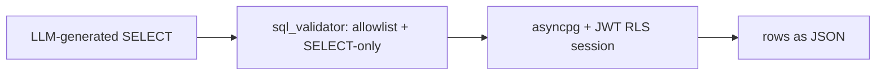

# Module 7 — Tool routing & agent flow

**Status:** Complete & validated (2026-06-14). See `PROGRESS.md` for re-test checklist.

How a user question becomes a final answer in the multi-tool agent (Module 7).

**Related code:** `backend/app/services/chat.py`, `tool_contracts.py`, `tool_dispatcher.py`, `tool_executor.py`, `retrieval.py`, `text_to_sql.py`, `web_search.py`

---

## High-level flowchart



---

## Phase-by-phase detail

### 1. User question → `ChatService.stream_turn`

| | |
|---|---|
| **Entry** | `POST /api/chat/stream` → `backend/app/routes/chat.py` |
| **Service** | `ChatService.stream_turn(thread_id, user_id, content, user_jwt)` |
| **Checks** | Thread ownership (RLS via Supabase JWT) |
| **Side effect** | User message saved to `messages` table |

The route passes the user's **Supabase JWT** so SQL tools can run with Row-Level Security as that user.

---

### 2. Build messages (what the LLM sees first)

**Component:** `ChatService._build_messages()` + `_build_system_content()`

```text
messages = [
  { role: "system", content: system_prompt + _AGENT_ROUTING_PROMPT },
  ... prior thread history (user/assistant, no system rows) ...,
  { role: "user", content: current question },
]
```

| Included in first LLM call | Not included |
|----------------------------|--------------|
| Base `system_prompt` from `config.py` | List of uploaded filenames |
| `_AGENT_ROUTING_PROMPT` (RAG vs SQL vs web rules) | Module 4 summaries (`metadata.llm`) |
| Chat history (up to `max_history_messages`) | Chunk text / embeddings |
| Current user question | Tool results (yet) |

**Important:** File summaries are **not** injected into the prompt before routing. The LLM decides tools from the **question wording** + **routing rules** + **tool descriptions**.

---

### 3. `build_available_tools` (which tools exist)

**Component:** `backend/app/services/tool_contracts.py` → `build_available_tools(settings)`

| Tool | Always? | Condition |
|------|---------|-----------|
| `search_documents` | Yes | Always registered |
| `query_database` | If enabled | `TEXT_TO_SQL_ENABLED=true` **and** `DATABASE_URL` set |
| `web_search` | If enabled | `WEB_SEARCH_ENABLED=true` **and** `TAVILY_API_KEY` set |

Each tool is an OpenAI **function** schema (name, description, parameters). The SQL tool description includes `SQL_SCHEMA_HINT` (allowed views/columns only).

---

### 4. `OpenAI create_chat_with_tools` (routing decision)

**Component:** `backend/app/services/openai_client.py`

- Model: `OPENAI_MODEL` (default `gpt-4o-mini`)
- Input: `messages` + `tools` + `tool_choice: auto`
- Output: assistant message with optional `tool_calls`

**Routing rules** (`chat.py` → `_AGENT_ROUTING_PROMPT`):

| Question type | Expected tool |
|---------------|---------------|
| Content inside documents (policies, CV, chapters) | `search_documents` |
| Counts, lists, filters on library metadata | `query_database` |
| Online / current / “search the web” | `web_search` |

The LLM may also answer **without any tool** (general knowledge only). The prompt discourages that for document-content questions but does not hard-enforce it in code.

**Loop limit:** up to `AGENT_MAX_TOOL_ITERATIONS` (default **3**) tool rounds per user message.

---

### 5a. `search_documents` → `RetrievalService`

**Path:** `ToolDispatcher` → `execute_search_documents` → `RetrievalService.retrieve(query)`



| Data searched | Data not searched |
|---------------|-------------------|
| `document_chunks.content` | `documents.metadata` summaries (unless chunk text mentions it) |
| User's chunks only (RLS) | Other users' documents |

**Tool result to LLM:** joined excerpt blocks + source filenames/snippets.  
**UI:** `sources` SSE event + `SourceCitations` chips.

---

### 5b. `query_database` → `TextToSqlService`

**Path:** `ToolDispatcher` → `execute_query_database` → `TextToSqlService.execute(sql, user_jwt)`



| Can query | Cannot query |
|-----------|--------------|
| `v_user_document_stats` (incl. `metadata` jsonb) | `document_chunks.content` |
| `v_user_chunk_meta` (structure metadata) | `embedding` |
| `v_user_chat_stats` (counts/dates) | Raw tables, writes/DDL |

**Tool result to LLM:** JSON rows (+ error string if validation fails).  
**UI:** `SqlAttribution` shows the executed SQL.

Summaries (`metadata.llm.summary`, `doc_type`, `topics`) are available **here via SQL**, not in the initial routing prompt.

---

### 5c. `web_search` → `TavilyWebSearchService`

**Path:** `ToolDispatcher` → `execute_web_search` → `TavilyWebSearchService.search(query)`

- REST call to Tavily (`search_depth`, `max_results` from settings)
- **Fail-open:** no key or API error → empty results, no crash

**Tool result to LLM:** markdown list of title, URL, snippet.  
**UI:** `WebSourceCitations` URL chips.

---

### 6. Tool result → messages → final stream

After each tool call:

1. SSE `tool_start` / `tool_end` emitted to frontend
2. Tool output appended as `{ role: "tool", tool_call_id, content }`
3. Loop continues if more tool rounds needed (max 3)

When the LLM returns **no** `tool_calls` (or iterations exhausted):

**Component:** `OpenAIClient.stream_chat_final(messages)` → token stream

- SSE `token` events → assistant reply in UI
- Message saved with `metadata.sources` and/or `metadata.tools`

---

## End-to-end example

**Question:** *“From which chapter should I start system design?”*

```text
1. System + routing + tools + question → OpenAI
2. LLM calls: search_documents({ query: "system design which chapter to start" })
3. RetrievalService returns excerpts from uploaded book/PDF chunks
4. LLM reads excerpts → streams: "Start with Chapter 2 …" + source chips
```

**Not used for this question:** SQL (unless user asked “how many system design PDFs”), web (unless “search online for …”).

---

## SSE events (frontend)

| Event | When | Payload |
|-------|------|---------|
| `tool_start` | Tool begins | `{ tool, args }` |
| `tool_end` | Tool finishes | `{ tool, status, result, error? }` |
| `sources` | After `search_documents` | Array of source citations |
| `token` | Final answer streaming | `{ content }` |
| `done` | Stream complete | `{ status: "ok" }` |
| `error` | Failure | `{ detail }` |

**Frontend:** `useChatStream.ts` parses events; `ChatPage.tsx` updates tool chips + attribution.

---

## What changed from Modules 2–6

| Before | Module 7 |
|--------|----------|
| RAG **always** on every message | RAG **only** if LLM calls `search_documents` |
| Chunks injected via `build_rag_system_prompt()` in system message | Chunks arrive **after** tool call in tool message |
| No SQL or web tools | Optional `query_database` + `web_search` |

---

## Possible future enhancement (not implemented)

Inject a **library catalog** (filenames + summaries) into the system prompt so the LLM knows what files exist **before** choosing a tool. Today it routes from question semantics only, then discovers content via RAG/SQL after the tool runs.
