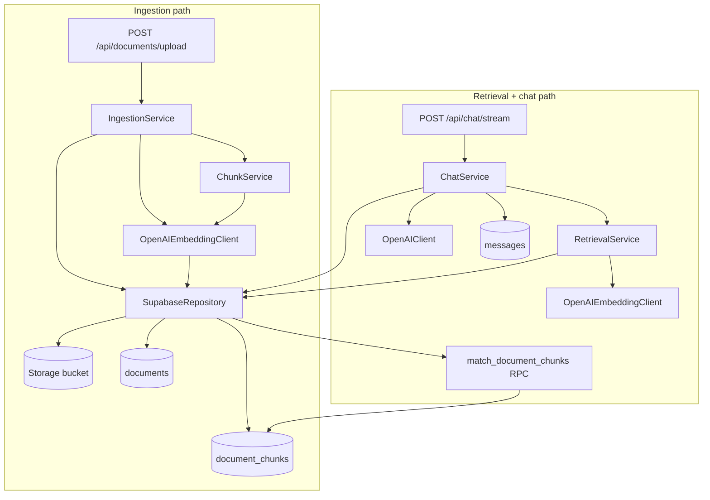

# RAG pipeline (ingestion → retrieval)

End-to-end flow for **Module 2** in this repo: how uploaded files become searchable chunks and how chat uses them. All orchestration lives in **`backend/app/`** (Python/FastAPI).

**Related:** Supabase tables & storage → [`../supabase/SCHEMA.md`](../supabase/SCHEMA.md) · Supabase services map → [`../supabase/SERVICES.md`](../supabase/SERVICES.md)

---

## Pipeline overview



**Two phases:**

1. **Ingestion** (upload time) — file → text → chunks → embeddings → Postgres + Storage  
2. **Retrieval** (each chat message) — question → embed → vector search → inject context → LLM reply

OpenAI is used twice with different APIs: **Embeddings** (index + search) and **Chat Completions** (answer).

---

## Python files (RAG-related)

| File | Layer | Role |
|------|-------|------|
| [`app/main.py`](app/main.py) | Entry | Mounts `/api/documents` and `/api/chat` routers |
| [`app/config.py`](app/config.py) | Config | `OPENAI_*`, `RAG_*`, `CHUNK_*`, system prompt builder |
| [`app/deps.py`](app/deps.py) | Auth | Validates JWT; provides `user_id` + `access_token` to routes |
| [`app/routes/documents.py`](app/routes/documents.py) | HTTP | Upload, list, delete documents |
| [`app/routes/chat.py`](app/routes/chat.py) | HTTP | SSE chat stream; emits `sources` then `token` events |
| [`app/services/supabase_client.py`](app/services/supabase_client.py) | Data | All Supabase Postgres, Storage, RPC calls |
| [`app/services/ingestion.py`](app/services/ingestion.py) | Domain | Upload pipeline orchestration |
| [`app/services/chunking.py`](app/services/chunking.py) | Domain | Extract text (.txt/.md/.pdf) + split into chunks |
| [`app/services/embedding.py`](app/services/embedding.py) | External | OpenAI `embeddings.create` |
| [`app/services/retrieval.py`](app/services/retrieval.py) | Domain | Embed query + call vector RPC + format sources |
| [`app/services/chat.py`](app/services/chat.py) | Domain | History + RAG context + stream + persist reply |
| [`app/services/openai_client.py`](app/services/openai_client.py) | External | OpenAI Chat Completions (streaming) |

**Not RAG-specific but used:** `deps.py` on every protected route; `config.py` for all thresholds and models.

---

## How files call each other

### Ingestion chain

```text
routes/documents.py
    └── IngestionService (ingestion.py)
            ├── SupabaseRepository (supabase_client.py)
            │       ├── create_document()      → table documents
            │       ├── upload_document_file() → Storage bucket "documents"
            │       ├── update_document()      → status pending → processing → ready/failed
            │       └── insert_document_chunks() → table document_chunks
            ├── ChunkService (chunking.py)
            │       └── chunk_file() → extract_text() + split_text()
            └── OpenAIEmbeddingClient (embedding.py)
                    └── embed_texts() → OpenAI API
```

**Construction per request:**

```python
repo = SupabaseRepository(access_token)   # documents.py
service = IngestionService(repo)           # default ChunkService + OpenAIEmbeddingClient inside
```

### Retrieval + chat chain

```text
routes/chat.py
    └── ChatService (chat.py)
            ├── SupabaseRepository
            │       ├── verify_thread_owner() / insert_message() / list_messages()
            └── RetrievalService (retrieval.py)  # default if not injected
                    ├── OpenAIEmbeddingClient.embed_texts([query])
                    └── SupabaseRepository.match_document_chunks() → RPC in Postgres
            └── OpenAIClient (openai_client.py)
                    └── stream_chat() → OpenAI Chat Completions
```

**Construction per request:**

```python
repo = SupabaseRepository(access_token)
service = ChatService(repo, OpenAIClient())  # RetrievalService(repo) created inside ChatService
```

---

## Phase 1: Ingestion (step by step)

**Trigger:** `POST /api/documents/upload` with multipart file + `Authorization: Bearer <JWT>`

| Step | Code | Action |
|------|------|--------|
| 1 | `deps.py` | Validate JWT → `user_id`, `access_token` |
| 2 | `documents.py` | Read file bytes |
| 3 | `ingestion.py` | Validate size (`max_upload_bytes`) and extension (`.txt`, `.md`, `.pdf`) |
| 4 | `supabase_client.py` | `build_storage_path` → `{user_id}/{document_id}/{filename}` |
| 5 | `supabase_client.py` | `create_document()` — row in `documents`, `status=pending` |
| 6 | `supabase_client.py` | `upload_document_file()` — bytes to Storage |
| 7 | `supabase_client.py` | `update_document()` — `status=processing` |
| 8 | `chunking.py` | `chunk_file()` — decode PDF/txt/md, split by `chunk_size` / `chunk_overlap` |
| 9 | `embedding.py` | `embed_texts(text_chunks)` — one vector per chunk (1536-dim) |
| 10 | `supabase_client.py` | `insert_document_chunks()` — text + embedding per row |
| 11 | `supabase_client.py` | `update_document()` — `status=ready` |
| 12 | `documents.py` | Return JSON to frontend |

**On failure:** step 11 instead sets `status=failed` + `error_message`; HTTP 422.

**Config used:** `config.py` → `max_upload_bytes`, `chunk_size`, `chunk_overlap`, `openai_embedding_model`

**Supabase writes:**

| Store | What |
|-------|------|
| `documents` | Metadata + status (Realtime updates UI) |
| `document_chunks` | Searchable chunks + `vector(1536)` |
| Storage `documents` | Original file |

---

## Phase 2: Retrieval + chat (step by step)

**Trigger:** `POST /api/chat/stream` with `{ thread_id, content }` + JWT

| Step | Code | Action |
|------|------|--------|
| 1 | `deps.py` | Validate JWT |
| 2 | `chat.py` | `prepare_stream(thread_id, user_id, content)` |
| 3 | `supabase_client.py` | `verify_thread_owner()` |
| 4 | `supabase_client.py` | `insert_message()` — save user message |
| 5 | `supabase_client.py` | `list_messages()` — prior history (cap `max_history_messages`) |
| 6 | `retrieval.py` | `retrieve(content)` |
| 6a | `embedding.py` | Embed user question |
| 6b | `supabase_client.py` | `match_document_chunks()` — RPC, filter by user + `ready` docs + threshold |
| 6c | `retrieval.py` | Build `context_blocks` + `RetrievedSource` list (filename, snippet, similarity) |
| 7 | `config.py` | `build_rag_system_prompt(context_blocks)` — system message with excerpts or base prompt if empty |
| 8 | `chat.py` | `_build_messages()` — system + history + new user turn |
| 9 | `openai_client.py` | `stream_chat()` — token stream |
| 10 | `chat.py` | On complete: `insert_message(assistant, metadata={sources})` |
| 11 | `chat.py` (route) | SSE: `sources` → `token` × N → `done` |

**If retrieval returns no chunks:** `context_blocks` is empty → model gets base system prompt only (no document context). UI shows no source chips.

**Config used:** `rag_top_k`, `rag_match_threshold`, `openai_model`, `openai_embedding_model`, `system_prompt`

---

## External systems

| System | Used in | Purpose |
|--------|---------|---------|
| **OpenAI Embeddings** | `embedding.py` | Ingestion: embed chunks; Retrieval: embed query |
| **OpenAI Chat** | `openai_client.py` | Generate assistant reply |
| **Supabase Postgres** | `supabase_client.py` | Tables + `match_document_chunks` RPC |
| **Supabase Storage** | `supabase_client.py` | Raw file upload/delete |
| **Supabase Auth** | `deps.py` | JWT validation (HTTP, not Python SDK) |

---

## Data shape at each stage

```text
Upload bytes
    → plain text (ChunkService)
    → list[str] chunks
    → list[list[float]] embeddings (1536 each)
    → rows in document_chunks

User question str
    → list[float] query embedding
    → RPC hits: { content, filename, document_id, similarity }
    → context_blocks: "[Source: file.pdf]\n{text...}"
    → LLM messages[] → streamed answer
    → messages.metadata.sources for UI citations
```

---

## HTTP API surface (RAG)

| Method | Path | Handler | Service |
|--------|------|---------|---------|
| POST | `/api/documents/upload` | `documents.upload_document` | `IngestionService.ingest_upload` |
| GET | `/api/documents` | `documents.list_documents` | `SupabaseRepository.list_documents` |
| DELETE | `/api/documents/{id}` | `documents.delete_document` | `SupabaseRepository.delete_document` |
| POST | `/api/chat/stream` | `chat.chat_stream` | `ChatService.prepare_stream` |

---

## Environment variables (RAG pipeline)

Set in **`backend/.env`** only:

| Variable | Default | Used by |
|----------|---------|---------|
| `OPENAI_API_KEY` | — | `embedding.py`, `openai_client.py` |
| `OPENAI_MODEL` | `gpt-4o-mini` | Chat |
| `OPENAI_EMBEDDING_MODEL` | `text-embedding-3-small` | Embeddings |
| `RAG_TOP_K` | `5` | Max chunks returned |
| `RAG_MATCH_THRESHOLD` | `0.5` | Min cosine similarity |
| `CHUNK_SIZE` | `600` | Characters per chunk |
| `CHUNK_OVERLAP` | `120` | Overlap between chunks |
| `MAX_UPLOAD_BYTES` | `10485760` | Upload limit |
| `SUPABASE_URL` / `SUPABASE_ANON_KEY` | — | `supabase_client.py` |

Re-upload documents after changing `CHUNK_SIZE` / `CHUNK_OVERLAP` — existing rows are not re-chunked automatically.

---

## Dependency graph (imports only)

```text
main.py
├── routes/documents.py ──► deps.py, ingestion.py, supabase_client.py
└── routes/chat.py      ──► deps.py, chat.py, openai_client.py, supabase_client.py

ingestion.py
├── chunking.py ──► config.py
├── embedding.py ──► config.py
└── supabase_client.py ──► config.py

retrieval.py
├── embedding.py
└── supabase_client.py

chat.py
├── config.py
├── openai_client.py ──► config.py
├── retrieval.py
└── supabase_client.py

chunking.py ──► config.py
embedding.py ──► config.py
openai_client.py ──► config.py (+ optional langsmith)
supabase_client.py ──► config.py
deps.py ──► config.py
config.py (no app imports)
```

---

## Delete path (cleanup)

`DELETE /api/documents/{id}` → `SupabaseRepository.delete_document`:

1. DELETE all `document_chunks` for that `document_id`  
2. DELETE `documents` row  
3. REMOVE file from Storage (best effort)

No OpenAI calls on delete.

---

## Module 3+ (not implemented yet)

Future **record manager** / dedup will extend `ingestion.py` and possibly `supabase_client.py` without changing the retrieval contract (`RetrievalService.retrieve` → same shape for `ChatService`).
