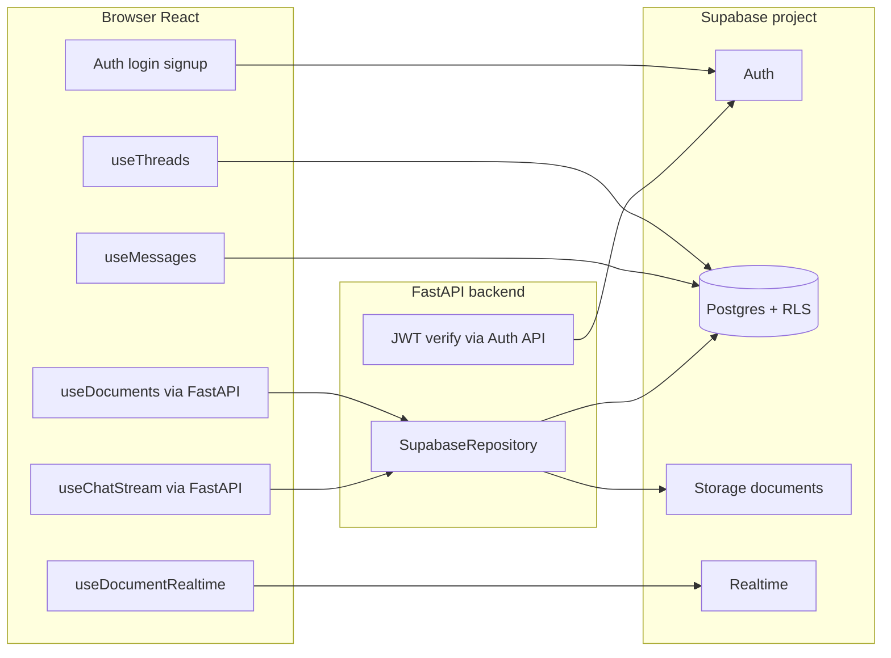

# Supabase services in this project

How the app uses Supabase: which products, which tables, who calls what (frontend vs backend), and how auth + RLS tie it together.

**Related:** table/column details → [`SCHEMA.md`](SCHEMA.md) · SQL migrations → [`migrations/`](migrations/) · Python ingestion/retrieval flow → [`../backend/RAG_PIPELINE.md`](../backend/RAG_PIPELINE.md)

---

## Supabase products we use

| Supabase product | Used? | Role in this app |
|------------------|-------|------------------|
| **Auth** | Yes | Email/password signup & login; JWT for every request |
| **Postgres (Database)** | Yes | Threads, messages, documents, chunks, pgvector search |
| **Row Level Security (RLS)** | Yes | Users only see their own rows (not a separate product — policy on Postgres + Storage) |
| **Storage** | Yes | Raw uploaded files in private bucket `documents` |
| **Realtime** | Yes | Live document status updates on the Documents page |
| **PostgREST / RESTRICT** | Yes | Table CRUD via client; vector search via `match_document_chunks()` |
| **Edge Functions** | No | — |
| **Supabase AI / Vector store (hosted)** | No | We use **pgvector in our own Postgres**, not Supabase’s managed vector product |

**Config:** same project URL + **anon key** in `backend/.env` and `frontend/.env` (`VITE_*`). No service-role key in this codebase — everything runs as the logged-in user.

---

## Who talks to Supabase?



| Path | Client | User JWT |
|------|--------|----------|
| Login / signup / session | Frontend `@supabase/supabase-js` | Issued by Auth |
| List/create threads | Frontend → Postgres | Yes (session in client) |
| Load message history | Frontend → Postgres | Yes |
| Document list/upload/delete | Frontend → **FastAPI** → Postgres + Storage | Yes (Bearer token forwarded) |
| Chat stream + RAG | Frontend → **FastAPI** → Postgres + RPC + OpenAI | Yes |
| Document status live updates | Frontend → Realtime | Yes (RLS on subscription) |

**Why split?** Chat and documents need **OpenAI** (chat + embeddings) on the server. The backend holds `OPENAI_API_KEY` and orchestrates Supabase + OpenAI. Auth and simple thread UI go direct to Supabase from the browser.

---

## 1. Auth

**What it is:** Supabase manages users in `auth.users` and issues JWT access tokens.

### Frontend

| File | What it does |
|------|----------------|
| [`frontend/src/lib/supabase.ts`](../frontend/src/lib/supabase.ts) | Creates Supabase client |
| [`frontend/src/components/auth/AuthProvider.tsx`](../frontend/src/components/auth/AuthProvider.tsx) | `getSession()`, `onAuthStateChange`, `signOut()` |
| [`frontend/src/components/auth/LoginForm.tsx`](../frontend/src/components/auth/LoginForm.tsx) | `auth.signInWithPassword()` |
| [`frontend/src/components/auth/SignupForm.tsx`](../frontend/src/components/auth/SignupForm.tsx) | `auth.signUp()` |

### Backend

| File | What it does |
|------|----------------|
| [`backend/app/deps.py`](../backend/app/deps.py) | Validates Bearer token via `GET /auth/v1/user`; returns `user_id` + raw token |

Every protected API route uses `get_current_user_id` and `get_access_token`. The token is passed into `SupabaseRepository(access_token)` so **RLS sees the same user** as the browser.

---

## 2. Postgres (Database)

**What it is:** Tables in `public` schema with RLS. Access via Supabase JS / Python client (PostgREST under the hood).

### Tables

| Table | Migration | Purpose |
|-------|-----------|---------|
| `threads` | `001` | One row per chat conversation |
| `messages` | `001` + `002` | Chat turns; `metadata` JSON for citation sources |
| `documents` | `002` | Upload metadata + processing status |
| `document_chunks` | `002` | Chunk text + `vector(1536)` embeddings |

See [`SCHEMA.md`](SCHEMA.md) for columns and relationships.

### Frontend → Postgres (direct)

| Hook / file | Table | Operations |
|-------------|-------|------------|
| [`useThreads.ts`](../frontend/src/hooks/useThreads.ts) | `threads` | **SELECT** list, **INSERT** new chat |
| [`useMessages.ts`](../frontend/src/hooks/useMessages.ts) | `messages` | **SELECT** history for active thread |

RLS ensures `user_id = auth.uid()` (threads) or messages only in owned threads.

### Backend → Postgres (via `SupabaseRepository`)

File: [`backend/app/services/supabase_client.py`](../backend/app/services/supabase_client.py)

| Method | Table / RPC | Operations | Called from |
|--------|-------------|------------|-------------|
| `verify_thread_owner` | `threads` | SELECT | Chat stream (access check) |
| `list_messages` | `messages` | SELECT | [`chat.py`](../backend/app/services/chat.py) — load history for LLM |
| `insert_message` | `messages` | INSERT | Chat — save user + assistant turns |
| `list_documents` | `documents` | SELECT | GET `/api/documents` |
| `get_document` | `documents` | SELECT | Delete flow |
| `create_document` | `documents` | INSERT | Upload — start pipeline |
| `update_document` | `documents` | UPDATE | Upload — status `processing` / `ready` / `failed` |
| `delete_document` | `document_chunks`, `documents` | DELETE | DELETE `/api/documents/{id}` |
| `insert_document_chunks` | `document_chunks` | INSERT | After chunk + embed |
| `match_document_chunks` | **RPC** | CALL | [`retrieval.py`](../backend/app/services/retrieval.py) — RAG search |
| `count_ready_documents` | `documents` | SELECT count | Defined; optional helper (not wired to UI yet) |

### SQL function (RPC)

| Function | Defined in | Purpose |
|----------|------------|---------|
| `match_document_chunks(query_embedding, match_count, match_threshold)` | `002_documents_rag.sql` | pgvector cosine similarity; filters `auth.uid()` + `status = 'ready'` |

---

## 3. Storage

**What it is:** Object store for original file bytes (not searchable — search uses `document_chunks` in Postgres).

| Setting | Value |
|---------|--------|
| Bucket name | `documents` (hardcoded `DOCUMENTS_BUCKET`) |
| Visibility | **Private** (create in dashboard) |
| Path pattern | `{user_id}/{document_id}/{filename}` |

### Backend only

| Method | Operation | When |
|--------|-----------|------|
| `upload_document_file` | **upload** | [`ingestion.py`](../backend/app/services/ingestion.py) after `create_document` |
| `storage.from_('documents').remove` | **delete** | `delete_document` |

Storage RLS (in migration `002`): first path segment must equal `auth.uid()`.

**Frontend never calls Storage API** — files go to FastAPI multipart upload, then backend uploads to Supabase.

---

## 4. Realtime

**What it is:** Postgres changes pushed over WebSocket to the browser.

| Setting | Value |
|---------|--------|
| Table published | `documents` (`alter publication supabase_realtime add table documents`) |
| Frontend hook | [`useDocumentRealtime.ts`](../frontend/src/hooks/useDocumentRealtime.ts) |
| Used on | [`DocumentsPage.tsx`](../frontend/src/pages/DocumentsPage.tsx) |

**Flow:** backend updates `documents.status` during ingestion → Realtime event → UI badge changes (`processing` → `ready`) without refresh.

**Not used for:** messages or threads (those are loaded on demand / after chat completes).

---

## 5. What we do **not** use Supabase for

| Concern | Handled by |
|---------|------------|
| LLM chat completions | OpenAI API ([`openai_client.py`](../backend/app/services/openai_client.py)) |
| Text embeddings | OpenAI API ([`embedding.py`](../backend/app/services/embedding.py)) |
| Chunking / PDF text extract | Python ([`chunking.py`](../backend/app/services/chunking.py)) |
| Observability (optional) | LangSmith |

---

## End-to-end flows

### A. Sign up and open chat

```text
1. Frontend: auth.signUp / signInWithPassword
2. Supabase Auth: row in auth.users + JWT
3. Frontend: useThreads → SELECT threads (RLS)
4. Frontend: useMessages → SELECT messages for thread_id
```

### B. Send a chat message (with RAG)

```text
1. Frontend: POST /api/chat/stream + Bearer JWT
2. Backend deps: verify JWT with Auth API → user_id
3. Backend: INSERT user message → messages
4. Backend: SELECT prior messages → messages
5. Backend: OpenAI embed query → RPC match_document_chunks → document_chunks
6. Backend: OpenAI stream reply → INSERT assistant message + metadata.sources
7. Frontend: SSE sources + tokens; reload or local state for citations
```

### C. Upload a document

```text
1. Frontend: POST /api/documents/upload + file + Bearer JWT
2. Backend: INSERT documents (pending)
3. Backend: Storage upload → documents/{user_id}/{doc_id}/file
4. Backend: UPDATE documents (processing)
5. Backend: chunk → OpenAI embed → INSERT document_chunks
6. Backend: UPDATE documents (ready)
7. Frontend: Realtime receives UPDATE → status badge updates
8. Frontend: GET /api/documents (initial list; Realtime patches)
```

### D. Delete a document

```text
1. Frontend: DELETE /api/documents/{id}
2. Backend: DELETE document_chunks → DELETE documents row → Storage remove file
```

---

## Security model (same for all services)

1. User logs in → JWT contains their `sub` (= `auth.uid()` in SQL).
2. **Frontend** Supabase client sends JWT automatically after login.
3. **Backend** forwards the same JWT to Postgres + Storage via `SupabaseRepository`.
4. **RLS policies** on tables and storage objects enforce ownership.
5. **Anon key** is public in the browser; security comes from JWT + RLS, not hiding the anon key.

---

## Environment variables (Supabase-related)

| Variable | Where | Purpose |
|----------|--------|---------|
| `SUPABASE_URL` | backend | Project URL |
| `SUPABASE_ANON_KEY` | backend | API key for Supabase client |
| `VITE_SUPABASE_URL` | frontend | Same URL |
| `VITE_SUPABASE_ANON_KEY` | frontend | Same anon key |

No bucket name, database password, or service-role key in env — bucket name is fixed in code; access is JWT + RLS.

---

## Quick reference: file → Supabase touchpoint

| File | Supabase services |
|------|-------------------|
| `frontend/src/lib/supabase.ts` | Client setup |
| `frontend/src/components/auth/*` | Auth |
| `frontend/src/hooks/useThreads.ts` | Postgres `threads` |
| `frontend/src/hooks/useMessages.ts` | Postgres `messages` |
| `frontend/src/hooks/useDocumentRealtime.ts` | Realtime `documents` |
| `frontend/src/hooks/useDocuments.ts` | Indirect — calls FastAPI, not Supabase directly |
| `frontend/src/hooks/useChatStream.ts` | Indirect — FastAPI |
| `backend/app/deps.py` | Auth HTTP verify |
| `backend/app/services/supabase_client.py` | Postgres + Storage + RPC |
| `backend/app/services/ingestion.py` | Orchestrates repo + OpenAI |
| `backend/app/services/retrieval.py` | RPC + OpenAI embed |
| `backend/app/services/chat.py` | messages + retrieval |
