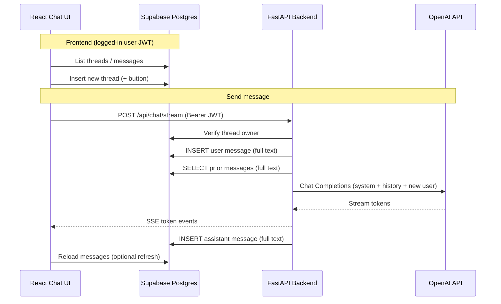

# Chat memory and database — how this app works

Module 1 uses **Supabase (Postgres)** as the single source of truth for conversations. **OpenAI does not store memory** — every reply is built from rows you load from the database.

---

## Short answers

| Question | Answer |
|----------|--------|
| Is memory a **summary**? | **No.** Each turn is stored as **full message text** in `messages.content`. |
| Who owns chat memory? | **Your Supabase database** (`threads` + `messages`). |
| Does OpenAI remember past chats? | **No.** The API is **stateless**; we send history on every request. |
| Who writes messages to the DB? | **Backend** writes user + assistant rows during `/api/chat/stream`. **Frontend** reads threads/messages and creates new threads. |

---

## Architecture overview



---

## Database (Supabase)

Migration: `supabase/migrations/001_threads_messages.sql`

### Table: `threads`

| Column | Purpose |
|--------|---------|
| `id` | UUID — one conversation |
| `user_id` | Owner — links to `auth.users` |
| `title` | Display name (default `"New chat"`) |
| `created_at` / `updated_at` | Sorting; `updated_at` bumps when a message is added |

### Table: `messages`

| Column | Purpose |
|--------|---------|
| `id` | UUID — one turn |
| `thread_id` | Which conversation |
| `role` | `user`, `assistant`, or `system` |
| `content` | **Complete message text** (not a summary) |
| `created_at` | Order of turns |

### Row Level Security (RLS)

- Every query runs as the **logged-in user** (JWT).
- Users only see **their own** `threads`.
- Users only see `messages` whose `thread_id` belongs to them.
- Another user cannot read or post into your thread.

---

## How memory is stored (important)

This app uses **message-level storage**, not summarization:

1. **User message** — exact string the user typed → one row in `messages`.
2. **Assistant message** — full reply text (all streamed tokens joined) → one row after streaming finishes.
3. **No compression** — there is no “memory summary” table and no automatic summarization in Module 1.
4. **History for the model** — on each send, the backend loads up to **50** prior messages (`max_history_messages` in `backend/app/config.py`) and sends their **full `content`** to OpenAI.

So “memory” = **the list of stored messages**, replayed into the model each time.

---

## Who talks to the database?

### Frontend (direct Supabase client)

File: `frontend/src/lib/supabase.ts` — browser client with anon key + user session.

| Action | Hook / page | SQL (via Supabase client) |
|--------|-------------|---------------------------|
| List chats | `useThreads` | `SELECT` from `threads` |
| New chat (+) | `useThreads.createThread` | `INSERT` into `threads` |
| Load history on screen | `useMessages` | `SELECT` from `messages` WHERE `thread_id` |
| Sign up / login | Auth forms | Supabase Auth (not `threads`) |

The frontend **does not** call OpenAI. It **does not** insert assistant messages (that is the backend’s job).

### Backend (FastAPI + Supabase with user JWT)

File: `backend/app/services/supabase_client.py` — `SupabaseRepository` attaches the user’s **Bearer token** so RLS applies.

| Action | When | What |
|--------|------|------|
| Verify thread | Start of stream | `SELECT` thread where `id` + `user_id` match |
| Save user turn | Before OpenAI | `INSERT` message `role=user`, `content=<typed text>` |
| Load history | Before OpenAI | `SELECT` messages ordered by `created_at` (cap 50) |
| Save assistant turn | After stream ends | `INSERT` message `role=assistant`, `content=<full reply>` |

Auth check: `backend/app/deps.py` validates JWT with Supabase `/auth/v1/user`.

Chat logic: `backend/app/services/chat.py`  
HTTP + SSE: `backend/app/routes/chat.py`

---

## Chat UI flow (what you see)

### 1. Open app / pick thread

- `ChatPage` loads threads from Supabase (`useThreads`).
- Selecting a thread loads messages (`useMessages`).

### 2. Click **+** (new chat)

- `INSERT` into `threads` with `user_id` + title `"New chat"`.
- UI sets that thread as active.

### 3. Send a message

**Frontend (`ChatPage.handleSend`):**

1. Adds **local** user bubble (instant UI).
2. Adds empty **local** assistant bubble.
3. `POST /api/chat/stream` with `{ thread_id, content }` and `Authorization: Bearer <session access_token>`.
4. For each SSE `token` event → updates assistant bubble text (`flushSync` + `updateLastAssistant`).
5. On `done` → `loadMessages()` and `loadThreads()` from Supabase (source of truth).

**Backend (`ChatService.stream_reply`):**

1. Confirm user owns `thread_id`.
2. **Persist** user message to DB.
3. **Load** all messages for thread (up to 50).
4. Build OpenAI payload:
   - `system` prompt (from config)
   - every stored message (`role` + full `content`)
   - new user message (again — last turn in the array)
5. Stream OpenAI response → SSE to browser.
6. **Persist** full assistant text to DB when stream completes.

**OpenAI (`openai_client.py`):**

- `stream=True` on Chat Completions.
- No OpenAI Threads API, no `file_search`, no server-side memory.

---

## How “memory” is sent to the model (receiver side)

OpenAI receives a **messages array**, for example:

```json
[
  { "role": "system", "content": "You are a helpful assistant..." },
  { "role": "user", "content": "Hello" },
  { "role": "assistant", "content": "Hi! How can I help?" },
  { "role": "user", "content": "What did I just say?" }
]
```

Built in `_build_messages()`:

- System prompt once.
- Every row from DB (except the duplicate handling: history load includes the new user row, so the code uses `history[:-1]` then appends the user message again in the payload).

The model only “remembers” what you **put in that array** — which comes from **full text rows** in Postgres.

---

## Streaming vs storage

| Stage | What happens |
|-------|----------------|
| **During reply** | Tokens travel over **SSE**; UI shows partial text. |
| **After reply** | Backend joins all tokens → **one string** → **one** `INSERT` into `messages`. |

So streaming is for **UX**; persistence is always the **complete** assistant message.

---

## What is NOT used (Module 1)

- OpenAI Assistants / Threads API  
- Conversation summaries or embedding-based memory  
- pgvector / RAG (Module 2+)  
- Frontend writing assistant rows to the DB  

---

## File map (quick reference)

| Area | Path |
|------|------|
| Schema + RLS | `supabase/migrations/001_threads_messages.sql` |
| Backend DB access | `backend/app/services/supabase_client.py` |
| Backend chat + memory build | `backend/app/services/chat.py` |
| SSE endpoint | `backend/app/routes/chat.py` |
| Frontend Supabase client | `frontend/src/lib/supabase.ts` |
| Threads sidebar | `frontend/src/hooks/useThreads.ts` |
| Message list | `frontend/src/hooks/useMessages.ts` |
| Stream consumer | `frontend/src/hooks/useChatStream.ts` |
| Chat screen wiring | `frontend/src/pages/ChatPage.tsx` |

---

## Mental model

Think of it as **a notebook**:

- Each page = one message (full text).
- The sidebar = list of notebooks (`threads`).
- OpenAI = a person who can only read the pages you photocopy and slide under the door **each time** you ask a question — they don’t keep the notebook.

That notebook lives in **Supabase**; your app is the pen and the copier.
