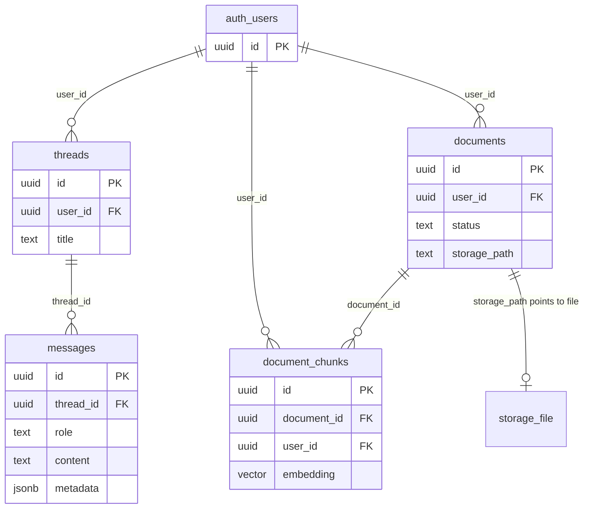

# Database schema reference

Migrations apply in order: `001_threads_messages.sql` → `002_documents_rag.sql`.

This doc explains **terms**, **every table column**, **how tables relate**, and **how one user gets many chats**.

---

## Glossary (terms you will see)

| Term | Meaning in this project |
|------|-------------------------|
| **Supabase Auth / `auth.users`** | Built-in user accounts (email/password). Each signup gets one row with a UUID `id`. |
| **JWT** | JSON Web Token issued at login. Sent as `Authorization: Bearer …` to the backend and to Supabase. |
| **`auth.uid()`** | Postgres function that returns the user id from the **current JWT**. Used in RLS policies. |
| **RLS (Row Level Security)** | Postgres feature: every query is filtered by policies so users only see/edit **their** rows. |
| **FK (foreign key)** | Column that must point to a row in another table (e.g. `messages.thread_id` → `threads.id`). |
| **`on delete cascade`** | If the parent row is deleted, child rows are deleted automatically. |
| **UUID** | Random unique id (e.g. `a1b2c3d4-…`). Used for threads, messages, documents. |
| **`timestamptz`** | Timestamp with timezone (`created_at`, `updated_at`). |
| **Thread** | One chat conversation in the sidebar (not an OS thread). |
| **Message** | One turn in a thread: user question, assistant answer, or system instruction. |
| **pgvector / `vector(1536)`** | Postgres extension storing a fixed-size list of floats (an **embedding**). `1536` = OpenAI `text-embedding-3-small`. |
| **Embedding** | Numeric representation of text meaning. Similar questions and similar passages get similar vectors. |
| **Chunk** | A slice of document text (e.g. ~1000 characters) stored in `document_chunks` with its own embedding. |
| **HNSW index** | Fast approximate index for “find vectors closest to this query vector.” |
| **RPC** | Remote procedure call — a SQL function you invoke by name, e.g. `match_document_chunks`. |
| **Cosine distance (`<=>`)** | How “far apart” two vectors are. Smaller distance = more similar. We convert to **similarity** = `1 - distance`. |
| **Storage bucket** | Supabase file store. Bucket `documents` holds raw `.txt` / `.md` / `.pdf` bytes. |
| **`metadata` (jsonb)** | Flexible JSON on `messages` — we store citation `sources` there for the UI. |
| **Realtime** | Supabase pushes DB changes to the browser (e.g. document `status` → `ready`). |
| **Trigger** | SQL that runs automatically on insert/update (e.g. bump `threads.updated_at`). |

---

## Relationships (all tables)

One **user** owns many **threads**, many **documents**, and (indirectly) many **messages** and **chunks**.



**Cardinality (how many of each):**

| From | To | Relationship | Example |
|------|-----|--------------|---------|
| User | Thread | **1 : many** | Alice has 5 separate chats |
| Thread | Message | **1 : many** | One chat has 20 back-and-forth messages |
| User | Document | **1 : many** | Alice uploaded 3 PDFs |
| Document | Chunk | **1 : many** | One PDF becomes 40 searchable chunks |
| User | Chunk | **1 : many** | (denormalized `user_id` for RLS and fast search) |

**Important:** Documents are **not** tied to a single thread. All of a user’s **ready** documents can be searched during **any** of their chats. Threads only scope **message history**; RAG scopes **documents by `user_id`**.

---

## How one user has multiple chats

There is **no** “one chat per user” limit. Each row in `threads` is a separate conversation.

1. User signs in → Supabase Auth gives them a stable `user_id` (UUID in `auth.users`).
2. User clicks **New chat** → frontend **inserts** a new row into `threads` with that `user_id`.
3. User sends a message → backend inserts into `messages` with that thread’s `thread_id`.
4. Sidebar lists **all** `threads` where `user_id = auth.uid()`, usually sorted by `updated_at` desc.

**Example data** (same user, three chats):

| threads.id | user_id | title | updated_at |
|------------|---------|-------|------------|
| `thread-aaa` | `user-111` | New chat | 2026-05-23 10:00 |
| `thread-bbb` | `user-111` | RAG questions | 2026-05-23 11:30 |
| `thread-ccc` | `user-111` | Notes cleanup | 2026-05-22 09:00 |

| messages.id | thread_id | role | content (short) |
|---------------|-----------|------|-----------------|
| `msg-1` | `thread-aaa` | user | Hello |
| `msg-2` | `thread-aaa` | assistant | Hi! |
| `msg-3` | `thread-bbb` | user | What does my PDF say about refunds? |
| `msg-4` | `thread-bbb` | assistant | According to policy.pdf… |

- `thread-aaa` and `thread-bbb` do **not** share message history.
- When you chat in `thread-bbb`, the backend loads only messages where `thread_id = thread-bbb`.
- RAG still searches **all** of `user-111`’s documents, not per-thread.

```text
user-111
├── thread-aaa  →  messages (Hello, Hi!, …)
├── thread-bbb  →  messages (refund question, answer + sources, …)
├── thread-ccc  →  messages (…)
└── documents   →  policy.pdf, notes.md  →  chunks (shared across all chats)
```

---

## Table details — Module 1

### `auth.users` (Supabase managed)

Not created by our migrations. Referenced by `user_id` on `threads` and `documents`.

| Column | Notes |
|--------|--------|
| `id` | UUID — same value as `auth.uid()` when that user is logged in |

---

### `threads`

One row = one chat in the sidebar.

| Column | Type | Required | Default | Description |
|--------|------|----------|---------|-------------|
| `id` | `uuid` | yes | `gen_random_uuid()` | Primary key; sent to API as `thread_id` |
| `user_id` | `uuid` | yes | — | Owner; FK → `auth.users(id)`, cascade on user delete |
| `title` | `text` | yes | `'New chat'` | Display name in sidebar |
| `created_at` | `timestamptz` | yes | `now()` | When the thread was created |
| `updated_at` | `timestamptz` | yes | `now()` | Bumped when a new message is inserted (trigger) |

**Indexes:** none beyond primary key (list queries filter by `user_id` + sort `updated_at`).

**RLS:** user can only CRUD rows where `user_id = auth.uid()`.

---

### `messages`

One row = one message in one thread.

| Column | Type | Required | Default | Description |
|--------|------|----------|---------|-------------|
| `id` | `uuid` | yes | `gen_random_uuid()` | Primary key |
| `thread_id` | `uuid` | yes | — | FK → `threads(id)`, cascade if thread deleted |
| `role` | `text` | yes | — | Must be `user`, `assistant`, or `system` |
| `content` | `text` | yes | — | Message body (plain text) |
| `created_at` | `timestamptz` | yes | `now()` | Order history by this |
| `metadata` | `jsonb` | yes | `'{}'` | **Module 2.** Citations: `{ "sources": [ … ] }` on assistant rows |

**Indexes:** `(thread_id, created_at)` — fast “all messages in this thread, in order.”

**RLS:** allowed only if `thread_id` belongs to a thread owned by `auth.uid()`.

**Trigger:** after insert on `messages` → update parent `threads.updated_at`.

---

## Table details — Module 2

### `documents`

One row = one uploaded file (metadata + pipeline state). Raw bytes live in **Storage**, not in this table.

| Column | Type | Required | Default | Description |
|--------|------|----------|---------|-------------|
| `id` | `uuid` | yes | `gen_random_uuid()` | Primary key |
| `user_id` | `uuid` | yes | — | Owner; FK → `auth.users(id)` |
| `filename` | `text` | yes | — | Original name, e.g. `report.pdf` |
| `mime_type` | `text` | yes | — | e.g. `application/pdf` |
| `storage_path` | `text` | yes | — | Path in bucket, e.g. `{user_id}/{doc_id}/report.pdf` |
| `status` | `text` | yes | `'pending'` | `pending` → `processing` → `ready` or `failed` |
| `error_message` | `text` | no | — | Set when `status = failed` |
| `byte_size` | `bigint` | yes | `0` | File size in bytes |
| `created_at` | `timestamptz` | yes | `now()` | Upload time |
| `updated_at` | `timestamptz` | yes | `now()` | Set on update (trigger) |

**Indexes:** `(user_id, created_at desc)` — list “my documents, newest first.”

**RLS:** `user_id = auth.uid()` for all operations.

**Realtime:** changes to this table are published so the Documents page updates live.

---

### `document_chunks`

One row = one searchable piece of a document.

| Column | Type | Required | Default | Description |
|--------|------|----------|---------|-------------|
| `id` | `uuid` | yes | `gen_random_uuid()` | Primary key |
| `document_id` | `uuid` | yes | — | FK → `documents(id)`, cascade if document deleted |
| `user_id` | `uuid` | yes | — | Same as document owner (for RLS + RPC filter) |
| `chunk_index` | `int` | yes | — | Order within file: 0, 1, 2, … |
| `content` | `text` | yes | — | Chunk text sent to the LLM as context |
| `embedding` | `vector(1536)` | yes | — | OpenAI embedding of `content` |
| `token_count` | `int` | no | — | Optional size hint |
| `created_at` | `timestamptz` | yes | `now()` | When chunk was stored |

**Indexes:**

- `(document_id, chunk_index)` — load all chunks for one file in order
- **HNSW** on `embedding` — fast similarity search

**RLS:** select/insert/delete where `user_id = auth.uid()` (no update — replace by re-ingesting).

---

### `storage.objects` (Supabase Storage)

Not a table you create in migrations; policies attach to the `documents` bucket.

| Concept | Value |
|---------|--------|
| Bucket name | `documents` (private; create in dashboard) |
| Path pattern | `{user_id}/{document_id}/{filename}` |
| Access | RLS: first folder must equal `auth.uid()` |

---

## Functions and triggers

### `match_document_chunks(query_embedding, match_count, match_threshold)`

**Purpose:** RAG retrieval — find the user’s most similar chunks.

| Parameter | Meaning |
|-----------|---------|
| `query_embedding` | Embedding of the user’s latest question |
| `match_count` | Max chunks to return (e.g. 5) |
| `match_threshold` | Minimum similarity (e.g. 0.7) |

**Returns:** `id`, `content`, `document_id`, `filename`, `similarity`.

**Filters:** only `auth.uid()`’s chunks, only documents with `status = 'ready'`.

**Called from:** `backend/app/services/retrieval.py`.

### `handle_thread_updated_at` (trigger)

On **insert** into `messages` → set parent `threads.updated_at = now()`.

### `handle_document_updated_at` (trigger)

On **update** to `documents` → set `documents.updated_at = now()`.

---

## End-to-end flows (quick)

### New chat message (Module 1 + 2)

1. `POST /api/chat/stream` with `thread_id` + `content`
2. Insert user row into `messages`
3. Load prior `messages` for that `thread_id`
4. Embed question → `match_document_chunks` → top chunks
5. Stream assistant reply; insert assistant `message` with `metadata.sources`
6. Trigger bumps `threads.updated_at`

### Upload document (Module 2)

1. Insert `documents` row (`pending`)
2. Upload file to Storage at `storage_path`
3. Set `processing` → chunk text → embed → insert `document_chunks`
4. Set `ready` (or `failed` + `error_message`)
5. Realtime notifies UI

---

## Module 1 vs Module 2 (summary)

| | Module 1 | Module 2 |
|---|----------|----------|
| **Tables** | `threads`, `messages` | `documents`, `document_chunks` |
| **Extends** | — | `messages.metadata`, Storage policies, pgvector |
| **Per-user scope** | Many threads, many messages per thread | Many documents, many chunks per document |
| **Tied to one chat?** | Messages yes (`thread_id`) | Documents no — shared across all user’s chats |
